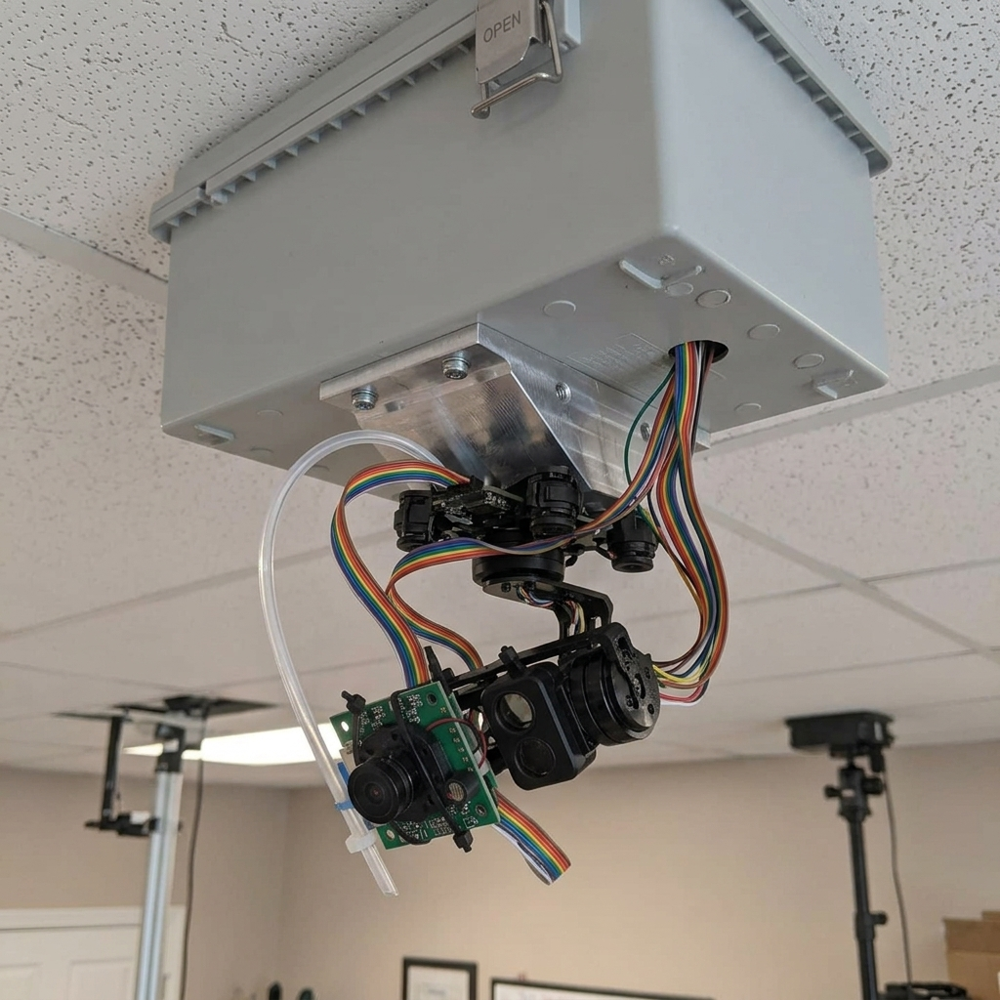
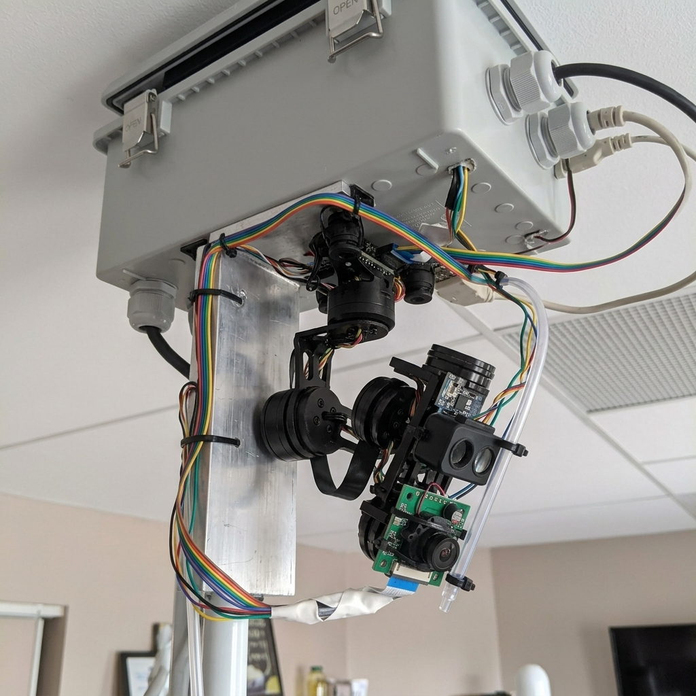
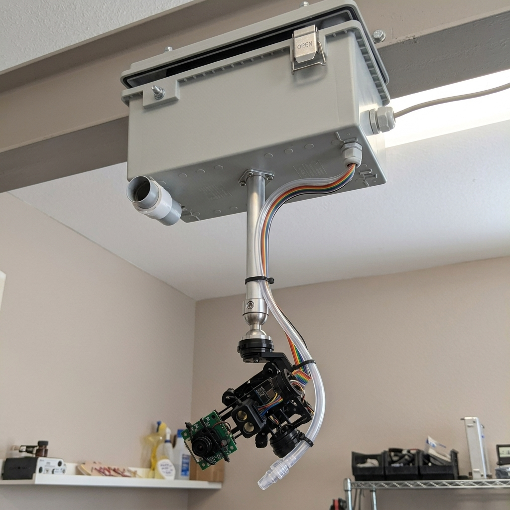
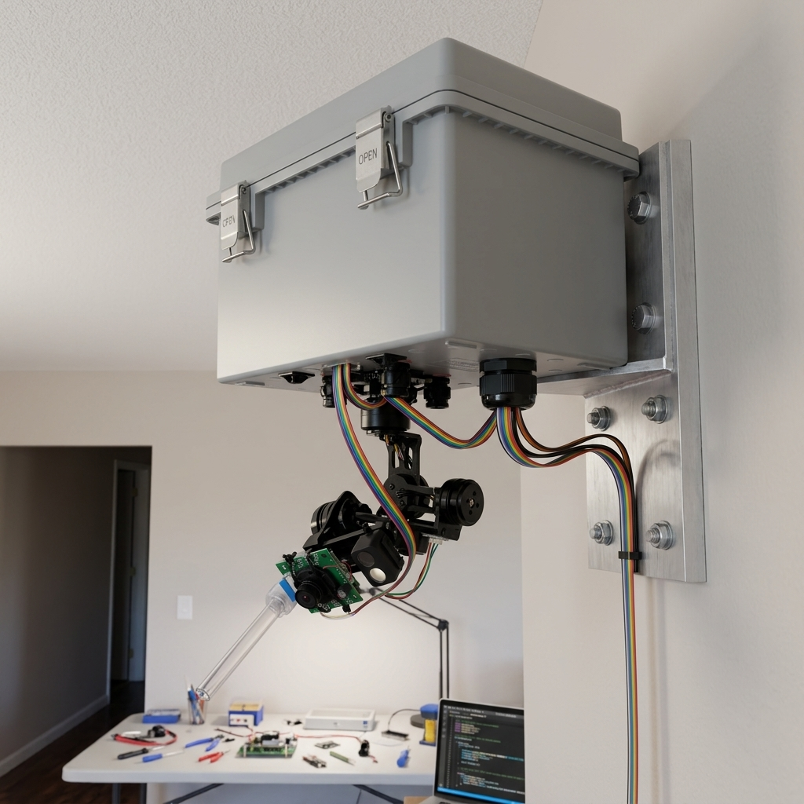
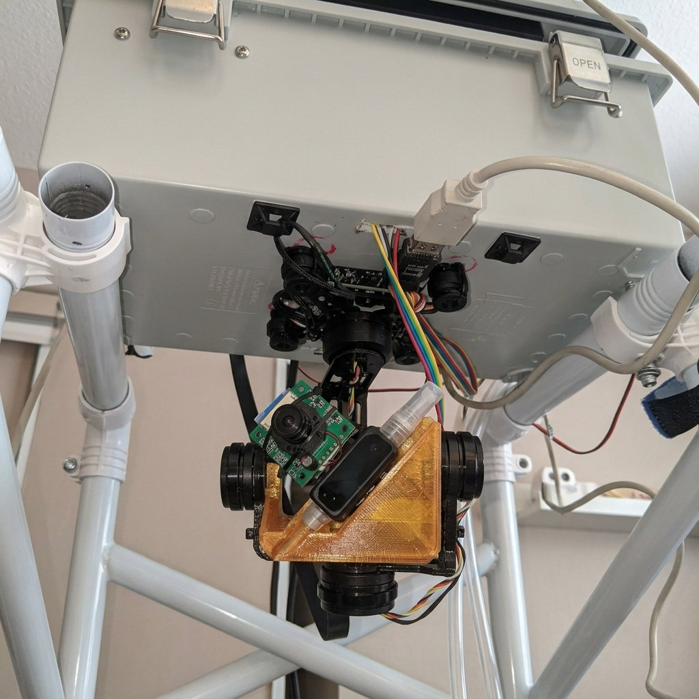

# Gimbal Mounting Options — Solving the Pitch Limitation

## The Problem

Your Storm32 gimbal has these hard constraints (from [HW-001 §3](../specs/HW-001-hardware-spec.md) and [spec sheet](image.png)):

| Parameter | Value |
|-----------|-------|
| **Pitch mechanical range** | ±45° |
| **Pitch joystick control** | ±25° |
| **Software endstop (current)** | ±20° |
| **Yaw range** | ±90° |

When mounted inverted on the ceiling at 8-10 feet:
- The gimbal's "neutral" position is **straight down** (toward the floor directly below)
- Positive pitch = tilts toward the floor (within ±45° of straight-down)
- You need to aim **outward** at ~45° from vertical to cover mosquito-flight zones at ground level across the room
- That's a **negative pitch** direction (toward the horizon), which hits the ±25-45° limit almost immediately

> [!IMPORTANT]
> The core issue: **You need ~45° of outward tilt, but only have 25° of controllable pitch range in that direction.** Even at the full ±45° mechanical limit, you're at the absolute edge with zero margin for tracking.

---

## Current Setup (Reference Photos)

See [real images/](real%20images/) for current gimbal photos showing the camera (green PCB, IMX219) and LiDAR (black sensor) mounted on the gimbal payload, facing straight down. The gimbal hangs vertically from the enclosure.

---

## Option 1: 45° Angled Wedge Bracket (⭐ RECOMMENDED)

**Concept:** Insert a **45° machined aluminum wedge** between the enclosure bottom and the gimbal's vibration-damper mounting plate. This pre-tilts the entire gimbal so its neutral position is already angled 45° outward.

| Aspect | Detail |
|--------|--------|
| **Modification** | Machine or buy a wedge bracket; swap 4 screws |
| **Pitch math** | Neutral now aims 45° outward. ±25° joystick range covers **20° to 70°** from vertical — perfect sweep zone |
| **Yaw impact** | Yaw axis is tilted but still functional; sweeps a cone instead of a flat plane |
| **Motor stress** | Minimal — gravity vector shifts slightly but payload weight (camera+lidar ≈ 50g) is well under 1.5kg capacity |
| **Nozzle routing** | Spray tube routes along the wedge bracket and zip-ties to payload — clean path |
| **Software change** | Update `gimbal_controller.py` coordinate transform to account for 45° pitch offset |
| **Reversible** | Yes — remove wedge, back to normal |

> [!TIP]
> **Why this is recommended:** Minimal mechanical change, no extra moving parts, full use of existing pitch/yaw range, and easy to fabricate with a drill press or 3D printer. The gimbal was designed to work at various mounting angles (drone use).

---

## Option 2: 90° Perpendicular Side Mount

**Concept:** Mount the gimbal **sideways** on a vertical L-bracket extending from the enclosure. The yaw axis now points horizontally, and the original pitch axis sweeps vertically toward the ground.

| Aspect | Detail |
|--------|--------|
| **Modification** | Fabricate vertical L-bracket + re-mount gimbal at 90° |
| **Pitch math** | Original pitch becomes vertical sweep. ±25° gives 25° above/below horizontal — covers ground zone |
| **Yaw impact** | Original yaw now sweeps **horizontally** — becomes the scanning axis. ±90° horizontal sweep is excellent |
| **Motor stress** | ⚠️ **This is your concern.** Yaw motor now bears the full payload weight as a cantilever. The 2805 motor handles 1.5kg max payload, and your sensors weigh ~50g — **well within limits** but sustained cantilevered load will wear bearings faster |
| **Nozzle routing** | More complex — tube must follow the L-bracket around the corner |
| **Software change** | Major — swap pitch/yaw axes in `gimbal_controller.py`, recalculate coordinate transform |
| **Reversible** | Yes — remove L-bracket |

> [!WARNING]
> While the motor can technically handle the load, **long-term bearing wear** is a concern. The yaw motor was designed for rotational inertia, not sustained cantilever gravity loading. Monitor for jitter/drift over weeks.

---

## Option 3: Drop-Arm with Swivel Ball Joint

**Concept:** A **12-inch aluminum drop arm** extends down from the enclosure. At its bottom, a **ball joint** allows you to set the gimbal at any angle (45° shown). The ball joint is locked with a set screw.

| Aspect | Detail |
|--------|--------|
| **Modification** | Aluminum rod + ball joint + mounting hardware |
| **Pitch math** | Ball joint sets any pre-tilt angle. Same as Option 1 but adjustable |
| **Yaw impact** | Full yaw range preserved |
| **Motor stress** | None — same as standard mounting |
| **Nozzle routing** | Clean — tube runs along the arm |
| **Software change** | Same as Option 1 — pitch offset in `gimbal_controller.py` |
| **Reversible** | Yes |

| Pro | Con |
|-----|-----|
| Adjustable tilt angle | Adds 12" of vertical profile — unit hangs much lower from ceiling |
| Clean cable routing along arm | Ball joint may loosen over time with vibration |
| Allows free rotation clearance | More complex fabrication |
| Visually clean | Increased moment arm → more sway from ceiling |

---

## Option 4: High Wall Mount (Not Ceiling)

**Concept:** **Don't mount on the ceiling at all.** Mount the enclosure high on a wall (8 ft). The gimbal hangs from the bottom as normal, but because the unit is elevated on a wall (not directly overhead), the gimbal naturally aims outward and downward at the room.

| Aspect | Detail |
|--------|--------|
| **Modification** | Wall bracket + relocate mounting point |
| **Pitch math** | Neutral is still straight down, but "straight down" is now **relative to the wall**, not the ceiling. The gimbal's ±25° pitch range sweeps from the wall face outward — covering 0°–50° of the room floor |
| **Yaw impact** | Full ±90° yaw sweeps across the room wall-to-wall |
| **Motor stress** | None — standard loading |
| **Nozzle routing** | Standard |
| **Software change** | Update coordinate transform for wall-mount geometry |
| **Reversible** | Yes — move back to ceiling |

> [!IMPORTANT]
> **Coverage trade-off:** Wall mounting covers a **semicircle** in front of the wall, not a full 360° area. You lose coverage directly behind/above the unit. For a corner room install, this may be ideal. For center-of-room, this won't work.

---

## Option 5: 3D-Printed Angled Payload Cradle

**Concept:** Keep the gimbal mounted exactly as-is. Instead, **3D-print a wedge adapter** that fits inside the gimbal's GoPro-style payload cradle. The camera, LiDAR, and nozzle mount on the angled face of the wedge — tilting them 45° relative to the gimbal centerline.

| Aspect | Detail |
|--------|--------|
| **Modification** | 3D-print a PLA/PETG wedge (~30 min print) |
| **Pitch math** | Effective neutral is 45° outward. ±25° pitch now covers 20°-70° from vertical |
| **Yaw impact** | Full yaw preserved |
| **Motor stress** | ⚠️ **Off-center payload.** The wedge shifts the center of gravity away from the gimbal's rotation axis. The PID controller will compensate, but may introduce slight oscillation. Weight must stay under ~80g total |
| **Nozzle routing** | Tricky — nozzle must follow the angled bracket, and the flex in the spray tube may fight the gimbal motors |
| **Software change** | Same as Option 1 — 45° pitch offset |
| **Reversible** | Yes — pop out the wedge |

> [!WARNING]
> The off-center CG will make the gimbal PID controller work harder. The IMU (MPU6050) will detect the offset and try to correct, which may cause jitter. Careful balancing and PID re-tuning needed. Also, added weight in the cradle may exceed the GoPro mounting strap's design limits.

---

## Comparison Matrix

| Criteria | Option 1: Wedge | Option 2: Perpendicular | Option 3: Drop-Arm | Option 4: Wall | Option 5: 3D Cradle |
|----------|:---:|:---:|:---:|:---:|:---:|
| **Ease of fabrication** | ⭐⭐⭐⭐ | ⭐⭐⭐ | ⭐⭐ | ⭐⭐⭐⭐ | ⭐⭐⭐⭐⭐ |
| **Motor stress risk** | ✅ None | ⚠️ Yaw bearing | ✅ None | ✅ None | ⚠️ CG offset |
| **Coverage area** | 360° cone | 360° cone | 360° cone | 180° semicircle | 360° cone |
| **Software complexity** | Low | High | Low | Medium | Low |
| **Aesthetic profile** | Compact | Bulky | Tall | Clean | Compact |
| **Long-term reliability** | ⭐⭐⭐⭐⭐ | ⭐⭐⭐ | ⭐⭐⭐⭐ | ⭐⭐⭐⭐⭐ | ⭐⭐⭐ |
| **Nozzle compatibility** | ✅ Easy | ⚠️ Routing | ✅ Clean | ✅ Easy | ⚠️ Tight |

## Recommendation

> [!TIP]
> **Go with Option 1 (Wedge Bracket)** as the primary solution. It's the simplest mechanical change with zero motor stress risk, full 360° coverage, and minimal software changes. You can fabricate the wedge with a 3D printer (PETG for strength) or have it machined in aluminum.
>
> **Fallback: Option 4 (Wall Mount)** if you're deploying in a room corner where 180° coverage is sufficient — zero custom fabrication needed.

## Open Questions

1. **Where in the room will this be deployed?** Center-of-room ceiling? Corner? Near a wall? This determines if 360° or 180° coverage is acceptable.
2. **Do you have access to a 3D printer?** If yes, Option 1 can be prototyped in under an hour.
3. **What is the exact deployment height?** 8 ft vs 10 ft changes the required tilt angle (at 10 ft with a 15 ft room, you need ~56° of outward tilt to reach the far wall at floor level).
