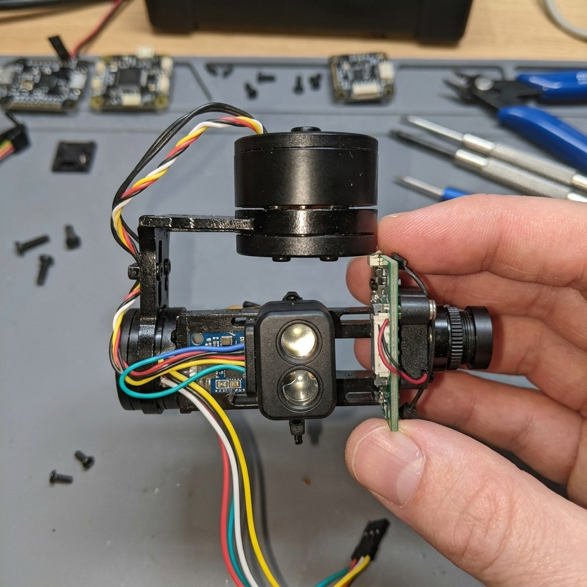
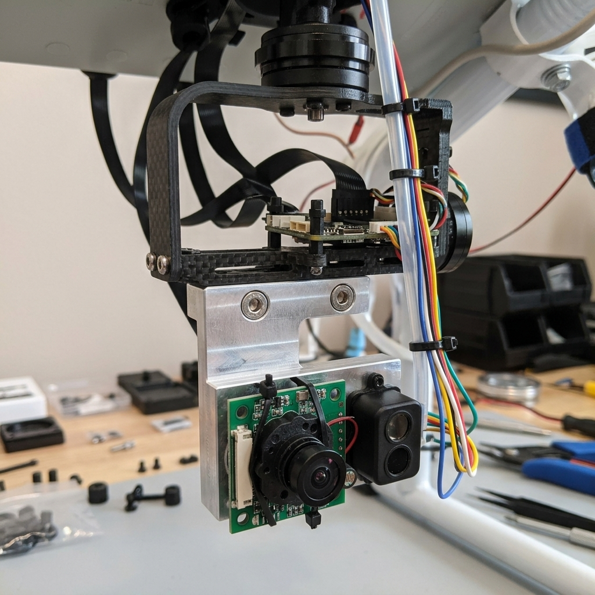
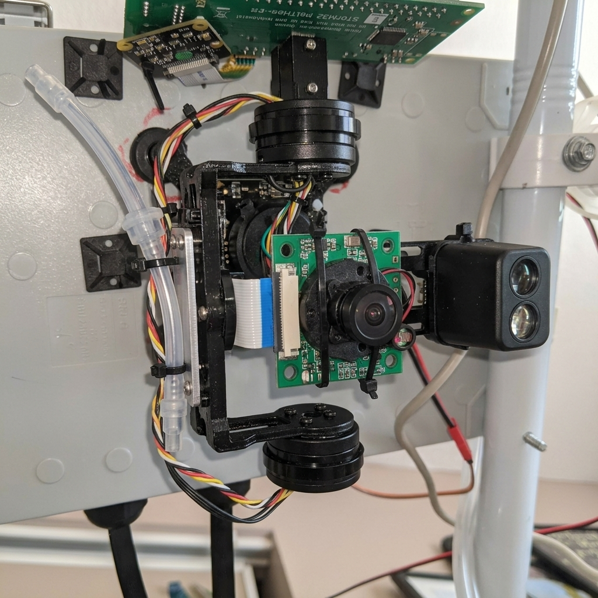
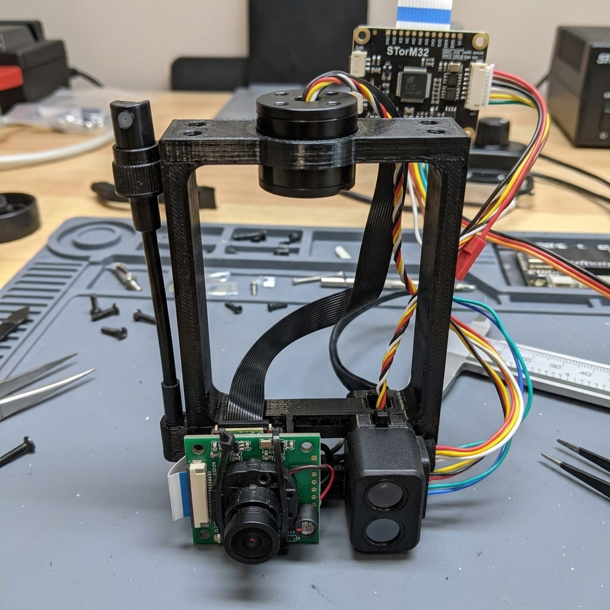
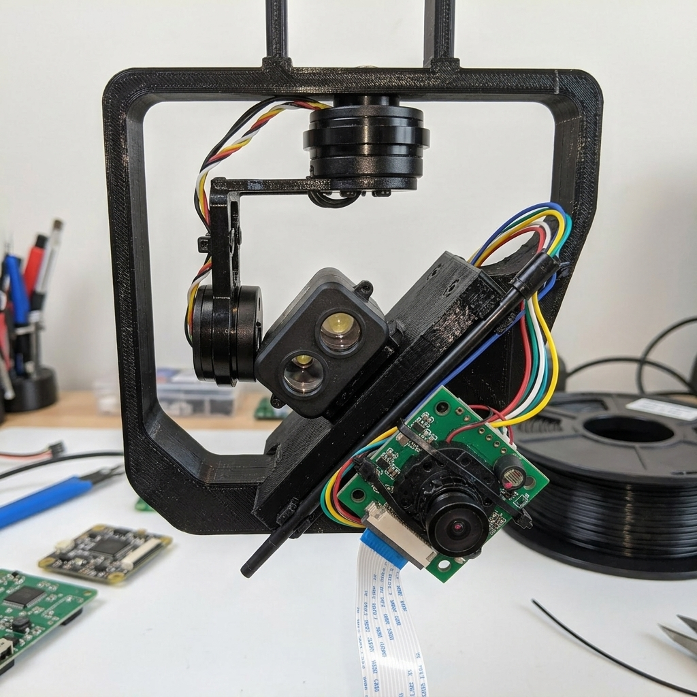
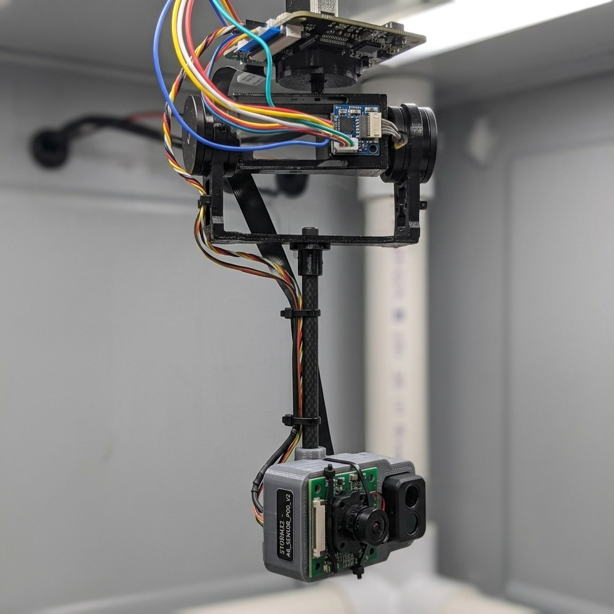

# Perpendicular Payload Mounting: Roll Motor Clearance Solutions

> **Spec Reference:** See [HW-001](../specs/HW-001-hardware-spec.md) for full hardware details.
> Related: [mounting_options.md](mounting_options.md) for overall ceiling-mount analysis.

## Problem Statement

The sniper camera (IMX219), LiDAR sensor, and spray nozzle currently face **straight down** inside the gimbal's GoPro-style U-shaped payload cradle. The system needs them rotated **90°** to face outward/horizontally for better ground coverage from the 8-10ft ceiling mount.

**The collision:** When the sensors are rotated 90°, the top edge of the camera PCB (~25mm tall when sideways) extends upward into the roll motor housing. The stock cradle provides only ~10-15mm of clearance between the payload slot and the roll motor body.

### Reference: Current Configuration

See [real images/](real%20images/) for current gimbal photos.

---

## Solution 1: Drop-Down L-Bracket Adapter ⭐ RECOMMENDED

A small aluminum or 3D-printed **L-shaped drop bracket** (~30mm tall, ~15g) bolts to the bottom crossbar of the existing stock U-frame. This lowers the sensor mounting point below the roll motor's interference zone, creating enough vertical clearance for perpendicular mounting.

| Attribute | Detail |
|---|---|
| **Fabrication** | 3D print (PETG/ABS) or CNC aluminum |
| **Added Weight** | ~10-15g (3D print) / ~20g (aluminum) |
| **Clearance Gained** | ~25-30mm below roll motor |
| **Modification to Gimbal** | None — bolts to existing crossbar holes |
| **Difficulty** | ⭐ Easy |
| **PID Retune Needed** | Minor — small weight shift downward |

### Why This Is Recommended

- **Zero modification** to the stock gimbal frame
- **Cheapest and fastest** to fabricate (single 3D print)
- **Reversible** — can remove bracket and return to stock
- **Weight stays centered** on the roll axis (just shifted down)
- **Best clearance-to-weight ratio** — 30mm drop for only 15g

> Print in PETG for weather resistance. Add M2.5 threaded heat-set inserts for clean bolting to the crossbar.

---

## Solution 2: Side-Mount Offset Plate

The sensors mount on the **outside face** of one of the two vertical arms of the U-frame, rather than inside the cradle. A thin aluminum or carbon fiber side plate attaches to the outer face of the arm.

| Attribute | Detail |
|---|---|
| **Fabrication** | Aluminum plate + M2 standoffs |
| **Added Weight** | ~12-18g |
| **Clearance Gained** | Complete — sensors are lateral to motor |
| **Modification to Gimbal** | 2 small drill holes in arm (or use adhesive standoffs) |
| **Difficulty** | ⭐⭐ Medium |
| **PID Retune Needed** | Yes — asymmetric weight distribution |

> **Warning:** The asymmetric mass offset will cause the gimbal to tilt toward the loaded side. PID retuning is mandatory, and roll stabilization may degrade slightly.

---

## Solution 3: Extended (Taller) Custom Cradle

Replace the stock U-frame entirely with a **taller custom U-frame** (3D printed, ~20-25mm taller). The extra height pushes the bottom crossbar further from the roll motor.

| Attribute | Detail |
|---|---|
| **Fabrication** | 3D print (PETG/ABS), must match roll motor shaft mount pattern |
| **Added Weight** | ~8-12g (net, replacing stock ~6g frame) |
| **Clearance Gained** | ~20-25mm additional |
| **Modification to Gimbal** | Full cradle replacement — must match roll motor screw pattern exactly |
| **Difficulty** | ⭐⭐⭐ Hard |
| **PID Retune Needed** | Yes — different moment of inertia |

> **Important:** Requires precise measurement of the roll motor shaft mounting holes (typically M2.5, ~28mm spacing). A poorly fitting replacement can introduce vibrations.

---

## Solution 4: 45° Wedge Adapter (Compromise Angle)

A small 3D-printed **45-degree wedge** (~15mm thick) mounts on the existing bottom crossbar. Instead of a full 90° rotation, the sensors point at 45°.

| Attribute | Detail |
|---|---|
| **Fabrication** | 3D print (PETG) |
| **Added Weight** | ~5-8g |
| **Clearance Gained** | N/A — no clearance issue at 45° |
| **Modification to Gimbal** | None |
| **Difficulty** | ⭐ Easy |
| **PID Retune Needed** | Minor |

> This is a **compromise**: you don't get true horizontal viewing, but combined with the gimbal's ±40° pitch, you could achieve effective look angles from ~5° to ~85° from vertical. May be sufficient depending on the mosquito engagement range.

---

## Solution 5: Pendulum Extension Arm

A thin carbon fiber or aluminum rod (~40mm long, 3mm diameter) hangs vertically from the bottom crossbar. At the bottom, a compact 3D-printed sensor pod holds all sensors facing outward.

| Attribute | Detail |
|---|---|
| **Fabrication** | Carbon fiber rod + 3D-printed pod |
| **Added Weight** | ~15-20g |
| **Clearance Gained** | Complete — sensors are ~40mm below cradle |
| **Modification to Gimbal** | None — mounts to crossbar |
| **Difficulty** | ⭐⭐ Medium |
| **PID Retune Needed** | Yes — pendulum inertia changes dynamic response |

> **Warning:** The pendulum effect can cause oscillation at certain gimbal speeds. The longer the arm, the worse the resonance. Requires careful PID tuning and potentially reducing gimbal movement speed.

---

## Comparison Summary

| Solution | Clearance | Weight | Difficulty | Gimbal Mod | PID Impact | Reversible |
|---|---|---|---|---|---|---|
| **1. Drop Bracket** ⭐ | 30mm | +15g | Easy | None | Minor | ✅ Yes |
| **2. Side Plate** | Full | +18g | Medium | Minor | Moderate | ⚠️ If drilled |
| **3. Tall Cradle** | 25mm | +12g | Hard | Full replace | Moderate | ✅ Keep old |
| **4. 45° Wedge** | N/A | +8g | Easy | None | Minor | ✅ Yes |
| **5. Pendulum** | Full | +20g | Medium | None | Significant | ✅ Yes |

---

## Recommendation

**Solution 1 (Drop-Down L-Bracket)** is the recommended approach. It provides the needed clearance with minimal weight, zero gimbal modification, easy fabrication, and is fully reversible.

If you want to start even simpler, **Solution 4 (45° Wedge)** is the lightest and easiest first step — it may give you enough angle when combined with the gimbal's existing pitch range.

### Open Questions

1. Do you have access to a 3D printer (or printing service)?
2. What is the exact clearance between the top of the payload slot and the roll motor body? (Caliper measurement helps determine minimum bracket height)
3. Would a 45° compromise angle (Solution 4) be acceptable? Combined with the gimbal's ±40° pitch, this gives ~85° total range.
