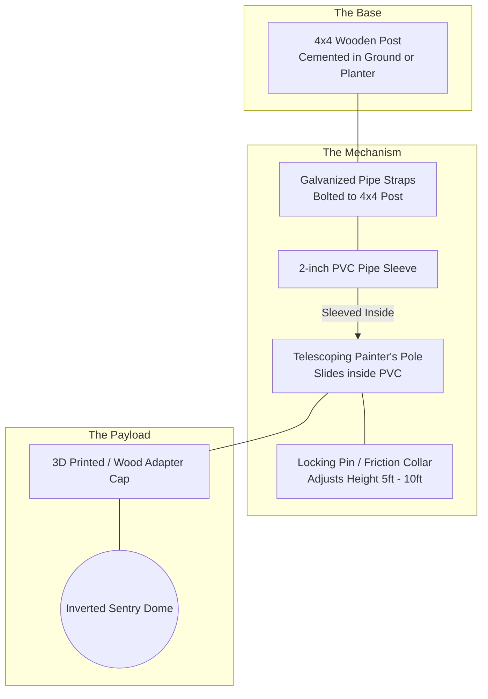
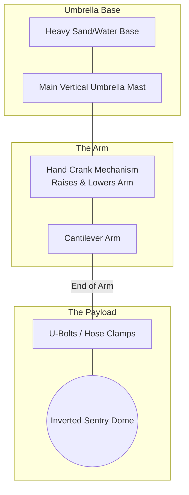
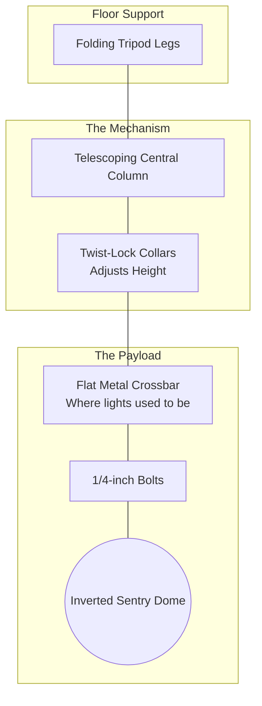
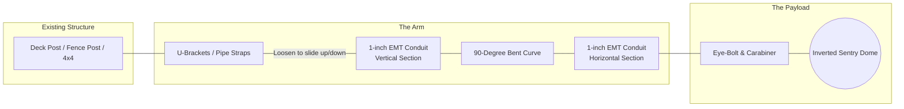
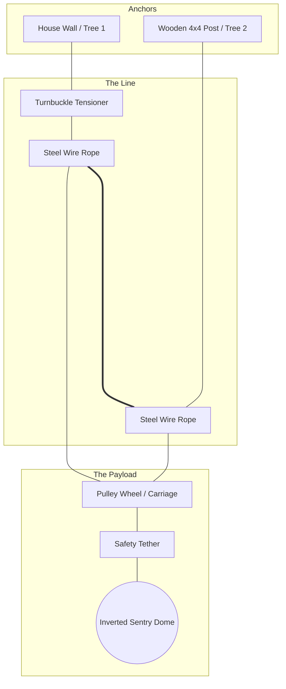
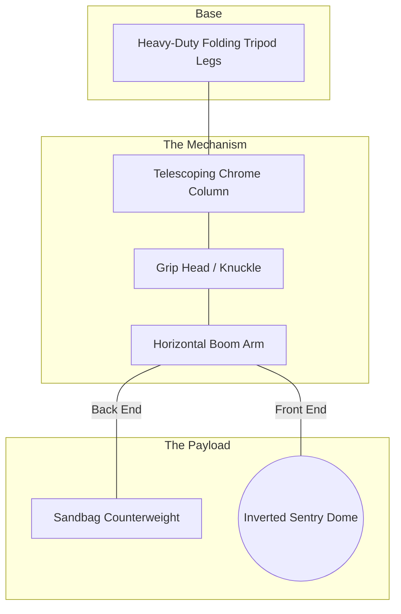
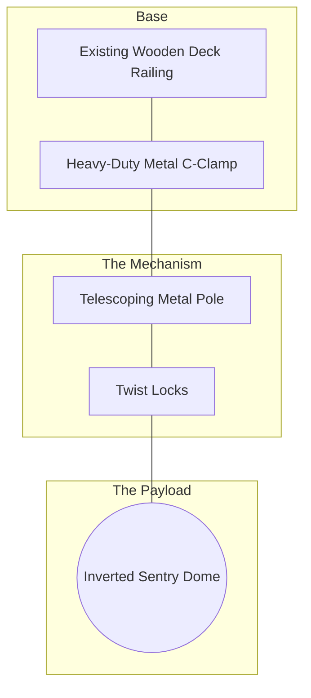
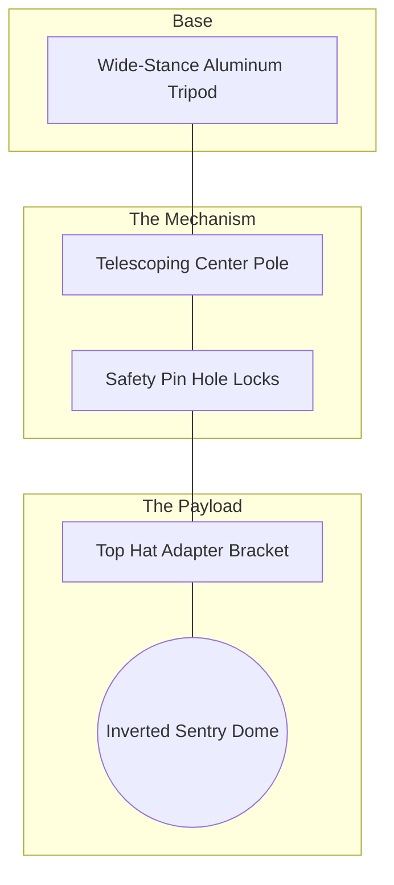
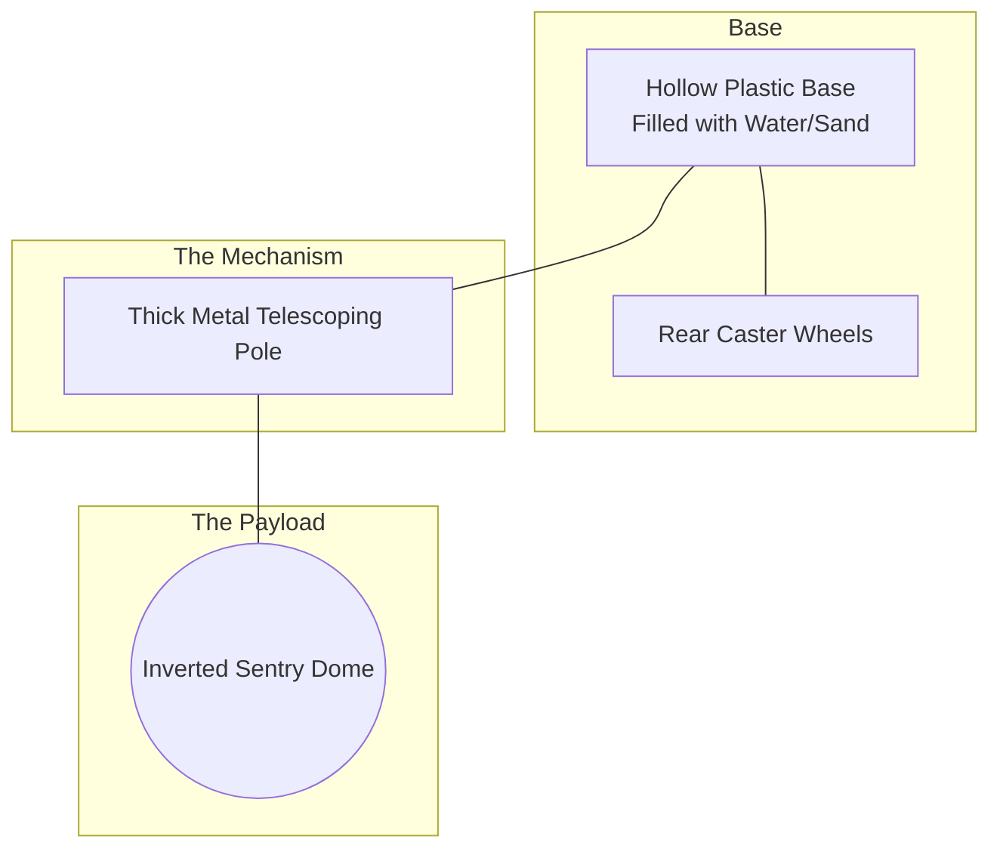
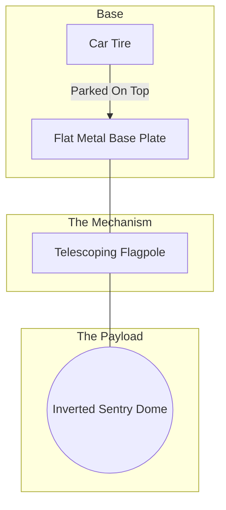

# Sentry Turret: 10 Creative Mounting Concepts

Here are ten creative ways to mount your "Hanging Dome" Sentry Turret. All of these concepts use readily available parts from stores like Home Depot, Rona, or Home Hardware, and focus on providing the vertical adjustability you need for indoor testing vs. outdoor deployment.

---

## 1. The "Post & Sleeve" Telescoping Mount
This concept directly combines a sturdy wooden 4x4 post with a telescoping mechanism. By attaching a PVC "sleeve" to the wooden post, you can slide an adjustable pole up and down.

**Materials needed:** 4x4 Wooden Post (8ft), 2-inch PVC Pipe (4ft), Galvanized Pipe Straps, Telescoping Painter's Pole (or pool pole), Locking Pins.
* **Pros:** Extremely rigid base; cheap to build; hides wiring inside the PVC/Pole.
* **Cons:** Requires digging a post hole or building a heavy planter base.

---

## 2. The Cantilever Patio Umbrella Conversion
Since you mentioned an umbrella pole, the absolute best off-the-shelf solution for an inverted dome is an **Offset (Cantilever) Patio Umbrella**. You simply remove the fabric canopy and use the existing heavy-duty arm to hang the sentry.

**Materials needed:** Cantilever Patio Umbrella (with hand crank), Sand/Water filled base weights, U-Bolts.
* **Pros:** Zero building required; comes with a hand crank to easily raise/lower the height; easy to move around the yard.
* **Cons:** Has a large footprint on the ground.

---

## 3. The Husky Worklight Tripod
Home Depot sells heavy-duty telescoping LED worklights (like Husky brand) mounted on bright yellow tripods. These are built to withstand job site abuse, are highly portable, and telescope from ~3ft up to 7ft or more. 

**Materials needed:** Husky Telescoping Tripod (remove the lights), custom mounting plate.
* **Pros:** Ultimate portability; great for moving between indoor testing and outdoor deployment; collapses for storage.
* **Cons:** Max height is usually around 7-8 feet, which might be slightly shy of your 10-foot goal unless put on a table/deck.

---

## 4. The EMT Conduit "Gallows" Arm
If you already have a fence post, a wooden 4x4, or a deck railing, you can use EMT (Electrical Metallic Tube) conduit. A 1-inch thick EMT pipe is incredibly strong and cheap. You can use a conduit bender to create a 90-degree curve, creating a perfect hanging point.

**Materials needed:** 1-inch EMT Conduit (10ft), EMT Conduit Bender (can rent at Home Depot), U-Brackets / Straps.
* **Pros:** Very clean industrial look; height can be adjusted by loosening the pipe straps on the post and sliding the conduit up or down.
* **Cons:** Requires a conduit bender tool for a smooth curve.

---

## 5. The Zipline / Steel Wire Pulley System
Instead of a pole, hang the system from the sky. String a tensioned steel cable between two trees, your house, or existing 4x4 posts. The sentry dome hangs from a pulley carriage. 

**Materials needed:** 1/8" Steel Wire Rope, Turnbuckles, Wire Rope Clips, Pulley Wheel, Carabiners.
* **Pros:** Infinite positioning across the yard; covers a massive area; no poles blocking the ground space.
* **Cons:** Height is fixed once the cable is strung; requires strong anchor points to support the tension and weight.

---

# Part 2: The Portable & Height-Adjustable Series

If you need a system that can be easily moved inside for testing and outside for deployment, while maintaining full height adjustability (up to 10ft), here are 5 highly portable options:

## 6. The Professional C-Stand with Boom Arm
Photography C-stands are built to handle heavy studio equipment, have a tiny folding footprint, and telescope extremely high. The boom arm allows you to offset the turret.

* **Pros:** Extremely professional look; folds completely flat; very portable; easily reaches 10ft.
* **Cons:** Requires a sandbag counterweight so it doesn't tip over.

---

## 7. The Deck Railing Telescoping Clamp
If you have a wooden deck or balcony overlooking your yard, you don't need a stand at all. Use a heavy-duty C-clamp to attach a telescoping pole directly to the railing.

* **Pros:** Zero footprint on the grass; attaches/detaches in 10 seconds; perfectly leverages existing structures for height.
* **Cons:** Limited to the perimeter of your deck.

---

## 8. The DJ Speaker Stand
Unlike heavy steel worklights, aluminum DJ speaker stands are incredibly lightweight and designed specifically for rapid teardown and transport.

* **Pros:** Extremely lightweight (easy to carry inside with one hand); safety pins prevent the pole from slipping down.
* **Cons:** Wide tripod footprint on the grass.

---

## 9. The Rolling "Suitcase" Water Base
Similar to a portable basketball hoop base or a commercial street sign, this plastic base can be filled with water or sand for massive stability, but easily tipped and rolled on its wheels.

* **Pros:** Ultimate stability (wind won't knock it down); very easy to roll around the patio or into the garage.
* **Cons:** The base is bulky and heavy when filled; harder to roll across thick grass compared to pavement.

---

## 10. The Tailgate "Drive-Under" Tire Mount
A brilliantly simple solution: a flat metal plate that you simply park your car tire on top of. A telescoping flagpole extends up from the plate. It uses the 3,000lb weight of your car as the anchor!

* **Pros:** Unbeatable stability without digging holes or carrying sandbags; highly portable (just pick up the plate when the car moves).
* **Cons:** Requires a vehicle or extremely heavy object to sit on the base plate; limits deployment strictly to the driveway/garage.
