# Sentry Turret: Mounting Concepts & Blueprints

## The Master Blueprint: Top-Hat Core Suspension Stack
The challenge of transitioning to an inverted dome is managing the mechanical step-down from a stationary upper chassis to a dynamic, hanging payload. If the structural layers are not aligned precisely, the moving gimbal will collide with the enclosure wall. 

To solve this, the system is anchored to a heavy-duty, flat internal aluminum baseplate (the NEMA box floor). The dome acts strictly as an aerodynamic skin over the top, while the gimbal drops down through a precision-cut opening.

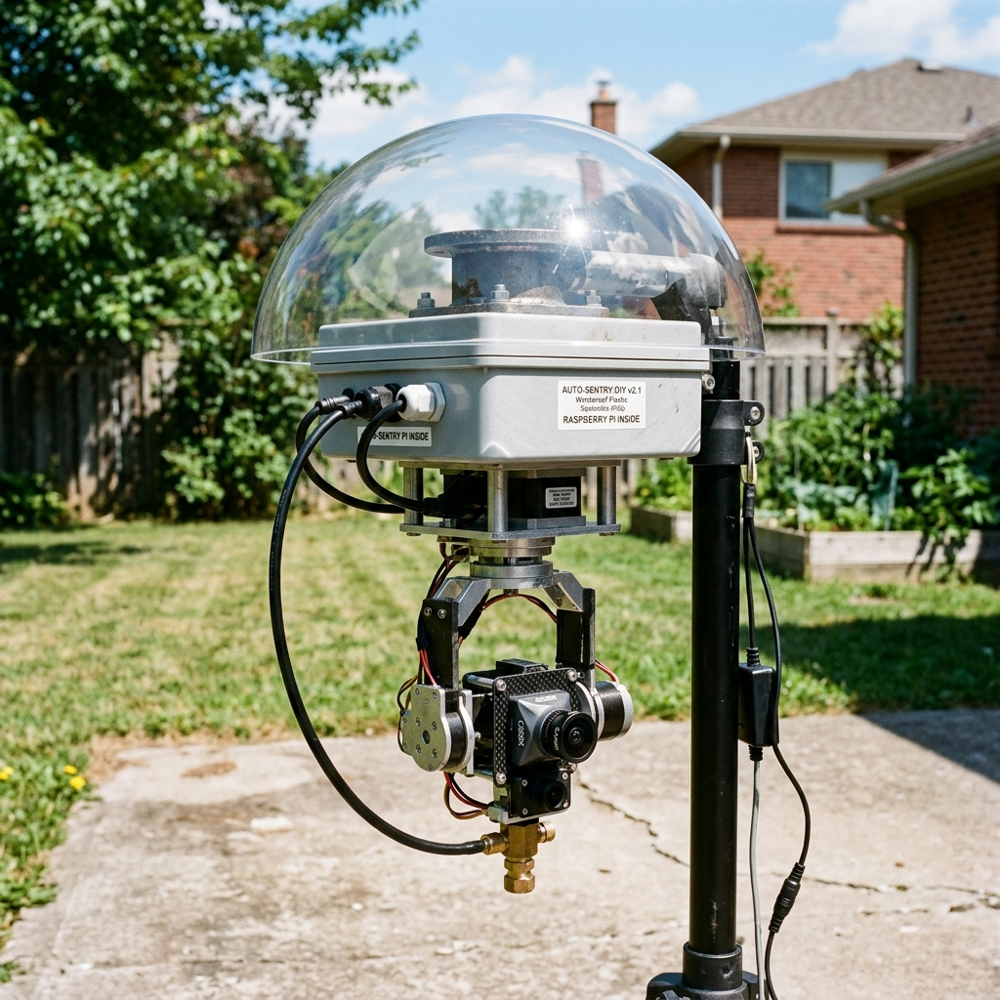

```text
                 ||  [Tripod Top Pole - 35mm Outer Diameter]
                 ||
                 vv
         .=================. <--- [1] ULTIMATE SUPPORT TSM-150MK TOP-HAT FLANGE
         |   _ _ _ _ _ _   |      (Bolted directly through the box top floor)
         |  |           |  |
    .----'--|-----------|--'----.
   /        |   JETSON  |        \  <--- [2] CLEAR COVERS INC. 12" FLANGED DOME
  /  _______|___________|_______  \      (Protective outer skin / rain umbrella)
 /  |                           |  \
|   |   JOINFWORLD IP67 BOX    |   | <--- [3] THE STRUCTURAL ELECTRONICS HUB
|   | (Horizontal Mounting Orientation)  (Houses Jetson, Relays, Pump, Wagos)
|   |___________________________|   |
 \               |                 /
  \              | <--- [Intake]  /
   \             v               /
    '------------|--------------'
                 v (Hose passes out through PG9 Gland to Ground Reservoir)
         ========================= <--- [4] UPPER MOUNTING BASEPLATE
                 |
                 v 
         [======|======] <--- [5] INVERTED STORM32 GIMBAL MOTOR AXIS
          \     |     /       (Hangs outside the dome, directly beneath the base)
           \    v    /
           [=========]   <--- MOVING AXIS TARGETING PLATE
            /   |   \
           v    v    v        (Equipped with low-profile M2.5 Button Heads)
        [Scout][Sniper][Orbit]
```

### Specific Component Sourcing
1. **The Mounting Anchor:** Ultimate Support TSM-150MK Top-Hat Flange (Industrial speaker cabinet adapter). Bolts to the top of the box.
2. **The Protective Skin:** Clear Covers 12-Inch Flanged Acrylic Hemisphere. Keeps the electronics dry while allowing the Scout camera to see through.
3. **The Enclosure Core:** Joinfworld NEMA 4 Weatherproof Junction Box. Mounted horizontally.
4. **The Portable Base Support:** Any 1.375-inch diameter professional PA tripod or staging pole (see 10 concepts below).

---

## The Weather Shield Evolution: The Deep Bell Canopy
If the electronics box is sitting flat and the gimbal is hanging completely exposed underneath it, a strong gust of wind will drive rain right into the exposed copper coils of the Storm32 brushless motors.

To protect the moving gimbal while still allowing the physical water nozzle to shoot out, we use the **"Deep Bell Canopy"** architecture. Instead of a clear dome that only protects the top, we take a wide, deep shell (like an 18-inch heavy-duty plastic planter) and mount it upside down like a giant lampshade.

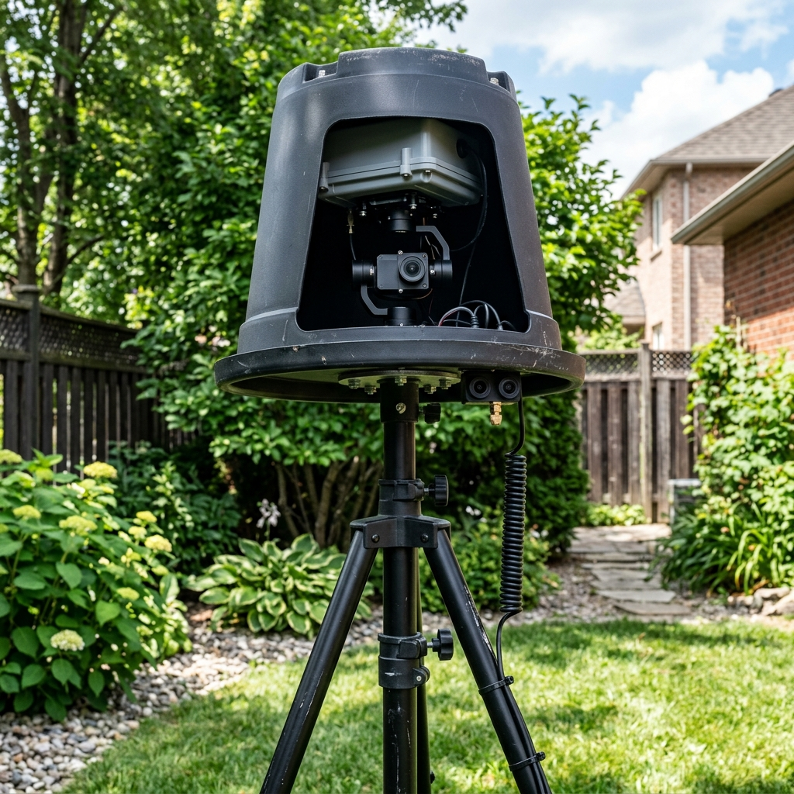

```text
                  .=================. <--- [1] TOP-HAT FLANGE (Quick Release)
                  |   _ _ _ _ _ _   |      (Slides onto Tripod Pole)
                  |  |           |  |
           .------'--|-----------|--'------.
         /           |   JETSON  |           \  <--- [2] THE DEEP BELL CANOPY
       /      _______|___________|_______      \     (18" Wide, opaque weather shield)
      /      |                           |      \    (Rain rolls off the wide edges)
     /       |   JOINFWORLD IP67 BOX     |       \   
    |        |___________________________|        |
    |                     |                       |
    |                     v                       |
    |            [========|========]              | <--- [3] STORM32 GIMBAL MOTORS
    |             \       |       /               |      (Tucked safely HIGH UP inside 
    |              \      v      /                |       the dry skirt of the canopy)
    |                 [Target]                    |
    |                 [Plate ]                    |
    |               /    |     \                  |
    |              v     v      v                 |
    .           [Cam0] [Cam1] [Nozzle]            . <--- [4] SENSOR PAYLOAD
                                                         (Sits exactly level with the 
                                                          canopy rim to allow a clear 
                                                          line of sight and firing arc)
```

### Why the Deep Bell is the Ultimate Mechanical Solution
1. **Total Motor Protection:** The delicate pitch and roll motors are suspended deep inside the "ceiling" of the bell. Angled rain hits the outer skirt, never reaching the motors.
2. **Unhindered Ballistics:** Because the bottom is wide open, the misting nozzle has a zero-obstruction path to fire its 45 PSI stream downward.
3. **Natural Heat Venting:** The massive greenhouse heat trap of a sealed clear dome is eliminated. The ambient outdoor breeze circulates up into the bell to cool the Jetson's heat sink naturally.

---

## Aesthetic Upgrades: Commercial-Grade Bell Canopies

If you want to upgrade from a repurposed plastic planter (the "backyard hacker" look) to a sleek, commercial-grade product aesthetic, here are the three best materials to use for your Deep Bell Canopy.

### 1. The "Stealth Industrial" Look: Spun Aluminum Pendant Shade (Top Pick)
Repurpose a large, modern industrial lighting fixture—specifically a **Matte Black Warehouse/Barn Pendant Shade**.

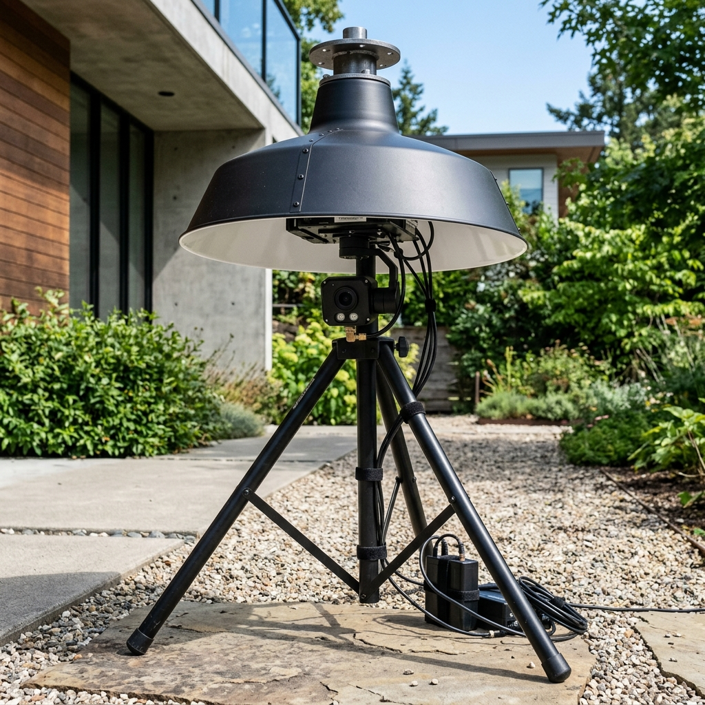

* **Aesthetics:** Spun aluminum with a powder-coated matte black exterior and a reflective white interior. Features a sweeping, elegant bell curve.
* **Functional Bonus:** Aluminum is highly thermally conductive. The entire metal bell acts as a giant passive heatsink for your Jetson and pump, drawing heat up and out into the ambient air.
* **Mounting:** Bolt the Top-Hat Flange over the existing top hole, mount the IP67 box inside the neck, and let the gimbal hang inside the wide flare at the bottom.

### 2. The "Sci-Fi Orb" Look: Smoked Acrylic Streetlight Globe
Use a **16-inch Smoked (Tinted) Acrylic Globe** with an open "neckless" bottom.

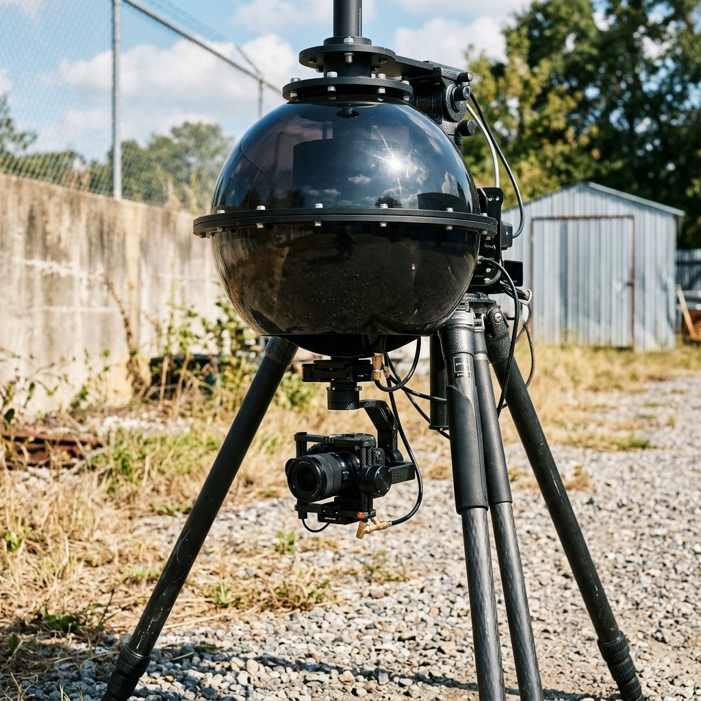

* **Aesthetics:** Looks like a floating dark glass orb. The heavy tint completely hides the internal messy wires, Wago connectors, and relays during the day.
* **Functional Bonus:** The dark tint naturally blocks harsh UV rays, while the open bottom allows the gimbal to fire freely and lets air cycle up into the orb.
* **Mounting:** Drill the top-hat flange to the top of the sphere, and mount the electronics and gimbal so they hang right at the "equator" of the open bottom.

### 3. The "Mil-Spec Security" Look: A Gutted Commercial PTZ Housing
Buy a massive, empty housing designed for commercial Pan-Tilt-Zoom (PTZ) cameras and gut the inside.

* **Aesthetics:** Comes with an integrated, heavy-duty wall/pole mounting arm, internal cable routing channels, and a built-in sun shield. It is the definition of professional perimeter security.
* **Functional Bonus:** Many commercial housings have built-in 12V exhaust fans and heaters. You can wire the existing fan directly into your power supply for instant active cooling.
* **Mounting:** Remove the dummy camera/internals. Mount the Jetson directly to the internal metal chassis. Remove the lower glass hemisphere entirely so the water nozzle has an unobstructed path to fire downward.

---

## The Ultimate Vision & Mechanics Split: The "Lighthouse" Architecture
If you drop the entire system inside a deep bell or an opaque cylinder, you completely blind your tracking sensors. The **OV9281 Scout Camera** and the **850nm IR Illuminator** cannot see through solid aluminum or tinted polycarbonate—they need a clear, unobstructed 180-degree field of view across the yard.

This means we have to separate the *stationary vision* (Scout/IR) from the *moving mechanics* (Gimbal/Sniper/Nozzle). We need an architecture where the vision sits "on the roof" while the mechanics hang safely "in the basement."

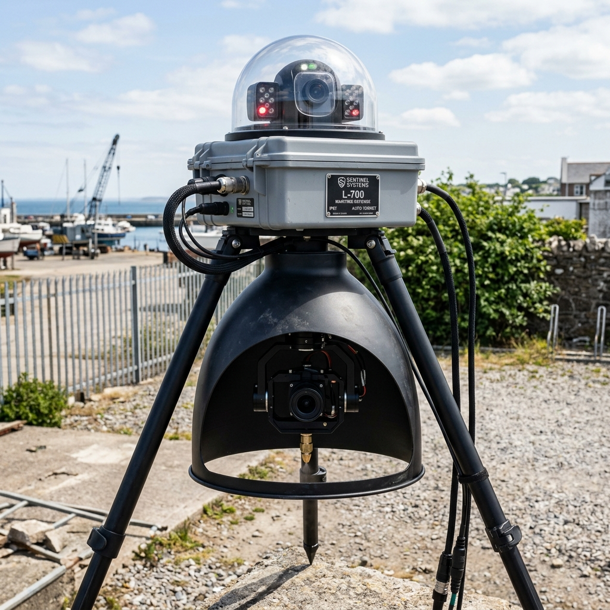

### The Dual-Stack Assembly
We use **two distinct enclosures** stacked vertically around the IP67 box:
1. **The Upper Lighthouse:** A completely clear, sealed, stationary acrylic dome mounted upright on top. The Scout Camera and IR Blaster live in here, giving them a perfect 360-degree panoramic view of the yard.
2. **The Lower Bunker:** A matte-black, opaque bell canopy hanging underneath. The gimbal hangs deep inside the skirt of this bell, protecting it from rain while giving the nozzle an open bottom to shoot through.

```text
                  .=================. <--- [1] TOP-HAT FLANGE (Quick Release)
                  |   _ _ _ _ _ _   |      (Slides onto Tripod Pole)
                  |  |           |  |
             .----'--|-----------|--'----.
            /        |           |        \   <--- [2] CLEAR ACRYLIC OBSERVATION DOME
           /  [IR BLASTER]   [SCOUT CAM]   \       (Faces outward. 180° unobstructed view)
          /_________________________________\ 
         |                                   |  <--- [3] JOINFWORLD IP67 BOX 
         |      (Jetson, Wagos, Relays)      |       (Horizontal Tray - Seals the system)
         |___________________________________|
           \              |                /  
            \             |               /   <--- [4] MATTE BLACK PENDANT CANOPY
             \            v              /         (Bolted to the UNDERSIDE of the IP67 box)
              \   [========|========]   /          (Deep weather skirt)
               \   \       |       /   /
                \   \      v      /   /       <--- [5] STORM32 GIMBAL MOTORS
                 \     [Target]      /             (Protected high up inside the skirt)
                  \    [Plate ]     /
                   \  /   |    \   /
                    v     v     v 
               [Sniper]      [Nozzle]         <--- [6] PAYLOAD FIRING LINE
                                                   (Aims downward out the open bottom)
```

### Why the Lighthouse Works Flawlessly:
1. **Zero Vision Obstruction:** Because the Scout camera and IR lights are in their own upright clear dome on the very top of the stack, their view of the yard is never blocked by the metal lip of a lampshade or the mechanical arms of the gimbal.
2. **True Weather Isolation:** The clear acrylic dome shields the delicate vision sensors, while the aluminum pendant skirt hanging below shields the delicate brushless motors. Driving rain cannot penetrate either section.
3. **Heat Segregation:** The IR illuminator (which gets incredibly hot) is isolated in the upper dome. The Jetson sits in the middle tray. The gimbal sits in the open-air bottom section. Heat doesn't build up in one massive trap.
4. **The "Turret" Aesthetic:** Stacking a clear dome on top of a dark, flared mechanical base looks exactly like a high-end maritime laser turret or an advanced defense array.

---

## Aesthetic Upgrades: Off-The-Shelf Commercial Conversions

To move past the basic "backyard utility" look without needing custom fabrication, you can repurpose items designed for upscale home decor, commercial lighting, or marine environments.

### 1. The "Studio-Tech" Column (Acrylic Display Cylinder + Anodized Wine Chiller)
Uses clean, modern shapes to create a minimalist tech look that belongs next to high-end electronics.

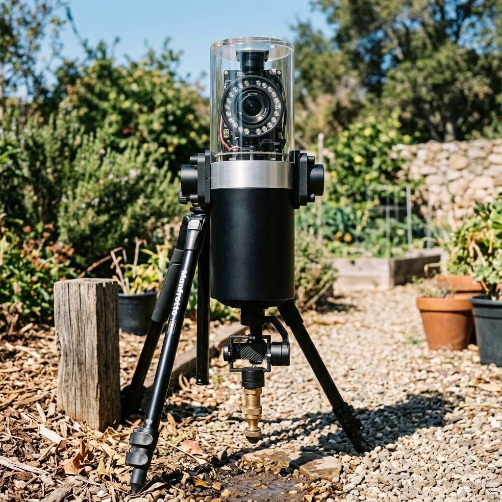

* **Structure:** The top tier is a 10-inch clear acrylic cylinder display case. The bottom is an inverted matte black anodized aluminum wine chiller bucket.
* **Optic Layer (Top):** The Scout Camera and IR Blaster sit inside the clear upper glass-like zone for a 360-degree view.
* **Mechanical Layer (Bottom):** The aluminum wine chiller acts as a sturdy lower housing, acting as a deep protective skirt around the inverted Storm32 Gimbal.

### 2. The "Bollard Monolith" (Commercial Pathway Lens + Internal Vinyl Masking)
Replicates the look of modern commercial landscape lighting found at luxury hotels.

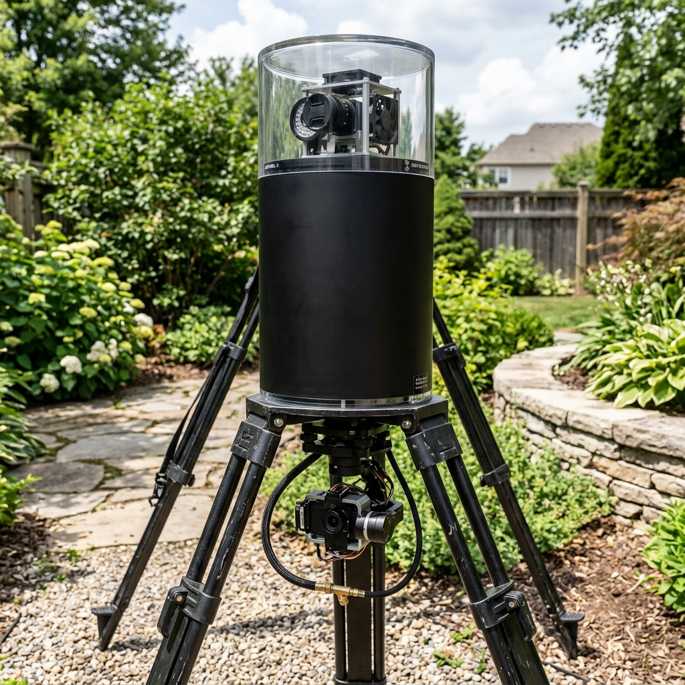

* **Structure:** A single, continuous heavy-duty clear polycarbonate bollard light cylinder.
* **Optic Layer (Top):** The top third is left completely clear, allowing the Scout camera and IR array to look out cleanly.
* **Mechanical Layer (Bottom):** To hide the internal wiring and Jetson tray, you apply matte-black automotive vinyl wrap to the *inside* surface of the lower two-thirds of the cylinder. The bottom is left open.

### 3. The "Mil-Spec Marine" Shroud (Brushed Stainless Steel Vessel + Panoramic Optical Slot)
Delivers a rugged, high-tech look inspired by naval defense hardware.

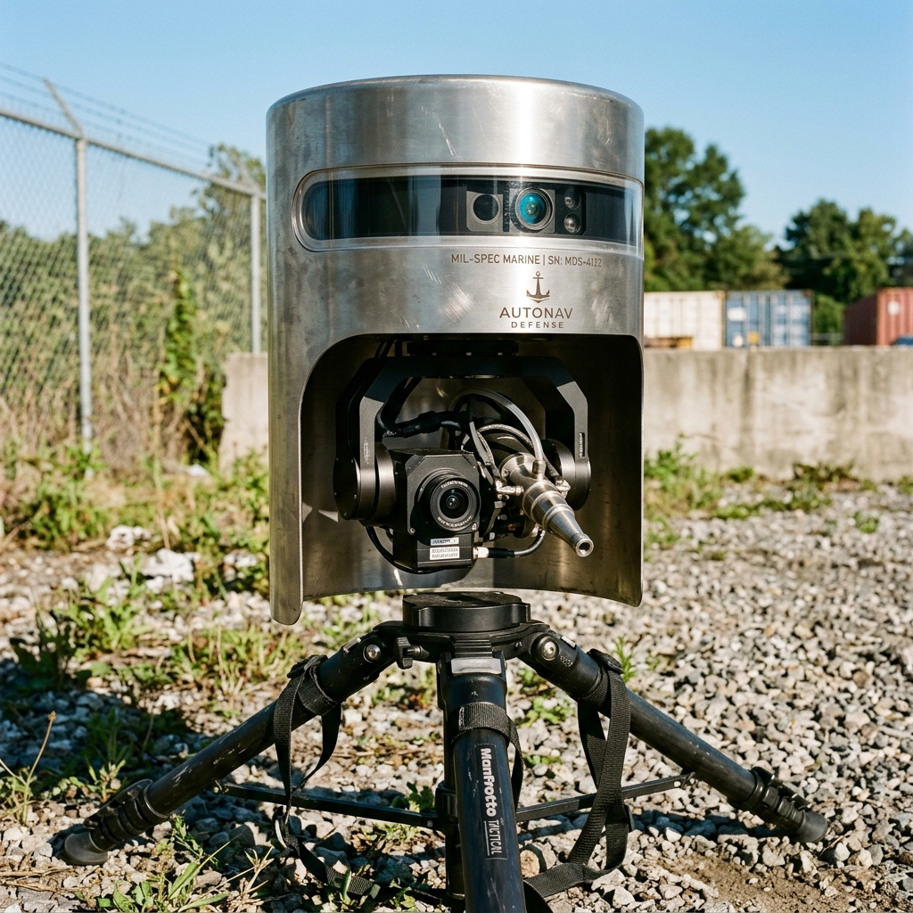

* **Structure:** An inverted brushed stainless steel seamless countertop canister.
* **Optic Layer (Top):** A smooth, continuous horizontal slot is cut around the upper perimeter of the canister, sealed internally with a clear PETG plastic strip to form a panoramic window.
* **Mechanical Layer (Bottom):** The electronics are tucked in the middle, and the gimbal hangs out of the wide-open bottom. The stainless steel acts as a natural heat sink.

---

## Aesthetic Upgrades: High-End Commercial Lighthouse Forms

To move completely away from an industrial-utility look and achieve a sleek, premium product aesthetic, you can upgrade the Lighthouse geometry using these three materials.

### 1. The Scandinavian Architectural Pillar (Spun Aluminum + Clear Polycarbonate)
Draws inspiration from minimalist, high-end outdoor landscape lighting.

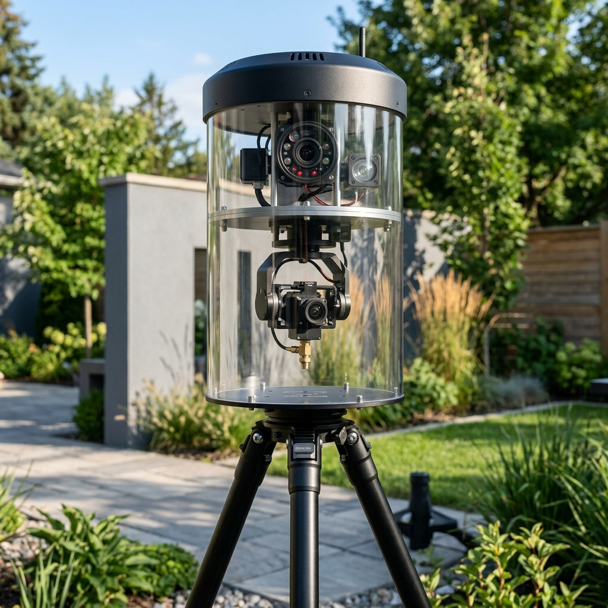

* **Structure:** A heavy-walled, 10-inch diameter clear polycarbonate cylinder sealed with a flat matte black spun aluminum cap.
* **Optic Layer (Top):** The Scout camera and IR blaster mount inside the upper section of the clear cylinder for a flawless 360-degree panoramic view.
* **Mechanical Layer (Bottom):** An internal horizontal shelf isolates the electronics. The gimbal bolts to the underside of this shelf, hanging completely inside the lower open-bottomed section of the cylinder.

### 2. The Streamlined Marine Radome (Composite Shroud + Panoramic Window)
Mimics the aerodynamic, eggshell-white satellite domes found on luxury yachts.

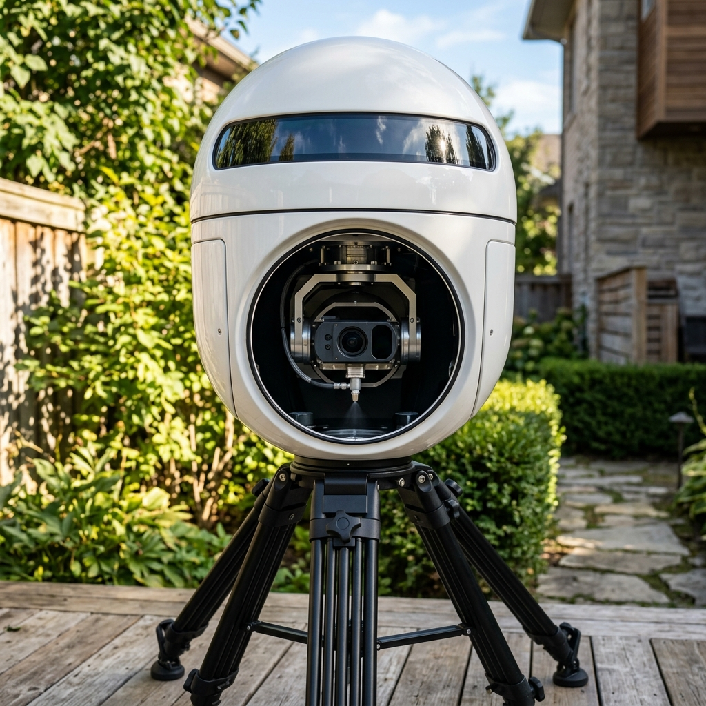

* **Structure:** An eggshell-white or space-grey fiberglass composite marine radome shell.
* **Optic Layer (Top):** A continuous horizontal slot is cut across the upper front face, sealed internally with a dark tinted PETG strip to form a panoramic window.
* **Mechanical Layer (Bottom):** The lower mounting plane is recessed up into the belly of the dome. The gimbal is suspended inside this deep internal cavity, hidden from the side but free to fire downward.

### 3. The Minimalist Tech-Pod (Tinted Cylinder + Internal Floating Chassis)
Focuses on a clean tech aesthetic, mimicking high-end server hardware or audio equipment.

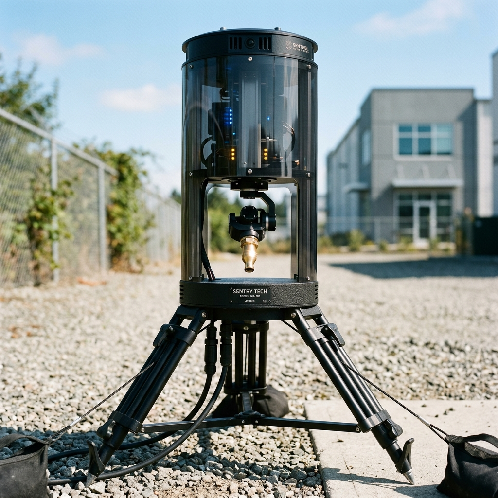

* **Structure:** A precision-cut, smoked dark grey transparent acrylic cylinder.
* **Optic Layer (Top):** 850nm IR light passes right through the tint at night. The Scout camera aligns with a small, clear optical cutout to ensure crisp 120FPS tracking.
* **Mechanical Layer (Bottom):** All components bolt to a central vertical aluminum spine (chassis rack). The dark cylinder extends down past the gimbal motors but terminates exactly before the nozzle tip.

---

# Part 1: The Primary Indoor/Outdoor Hybrid Mount

## 1. The Heavy-Duty PA Speaker Stand (Quick-Release Tripod)
This is the ultimate solution for hybrid development (writing code indoors, testing with live water outdoors). It breaks down into two lightweight pieces in under 10 seconds. Standard speaker tripods have a 35mm top pole that perfectly matches the Top-Hat flange. You simply lift the entire dome assembly off the pole.

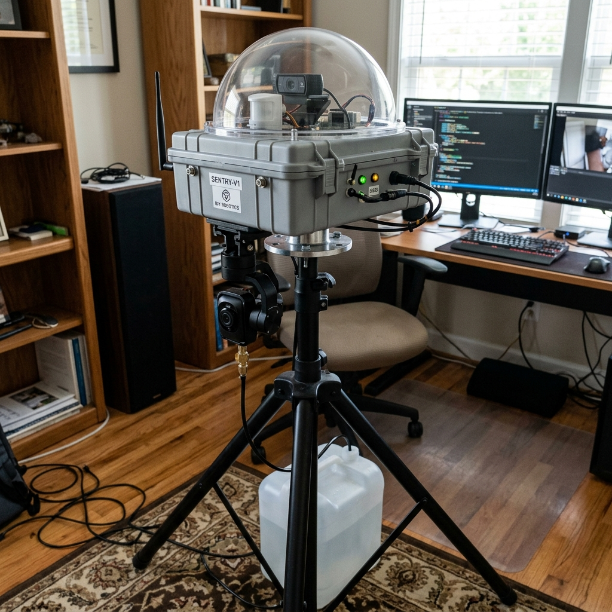

```text
                  .=================. <--- [1] TOP-HAT FLANGE (Quick Release)
                  |   _ _ _ _ _ _   |      (Lifts right off the pole)
                  |  |           |  |
             .----'--|-----------|--'----.
            /        |   JETSON  |        \  <--- [2] WEATHER DOME
           /  _______|___________|_______  \      (Protective skin)
          /  |                           |  \
         |   |   JOINFWORLD IP67 BOX     |   | <--- [3] ELECTRONICS HUB
         |   |___________________________|   |      (Pump & Relays inside/adjacent)
          \               |                 /
           \              v (Hanging)      /
            '------------ | --------------'
                 [========|========] <--- [4] INVERTED GIMBAL & CAMERAS
                  \       |       /       (Shoots downward toward the floor)
                   \      v      /
                      [Nozzle]

======================================================= (Disconnects Here)

                          ||  <--- [5] TELESCOPING ALUMINUM CENTER POLE
                          ||       (Adjusts from 40" indoor to 72" outdoor)
                          || 
                          ||
                       .--||--.  <--- Tripod Collar
                      /   ||   \
                     /    ||    \
                    /     ||     \
                   /      ||      \
             [Leg]        ||        [Leg]
                          ||
                          ||
                ____[Water Tote]____  <--- [6] RESERVOIR / COUNTERWEIGHT
               |                    |      (Sits between the tripod legs)
               |____________________|
```

### Why the PA Tripod works perfectly:
1. **The "Quick Release":** No unscrewing or unbolting. The flange just lifts off.
2. **Office-Friendly Height:** Drop it to 3.5 feet indoors; extend it to 6.5 feet outdoors.
3. **The Perfect Water Base:** The wide, folding legs create a perfect "cage" for a shallow water tote, acting as a heavy anchor weight.

**Indoor Testing Note:** Unplug the relay or pull the intake tube from the water bucket indoors. The Sentry will still physically track you, aim the nozzle, and "click" the relay to fire, allowing you to debug the tracking math completely dry.

---

# Part 2: The Alternative Mounting Concepts

Here are additional creative ways to mount your "Hanging Dome" Sentry Turret using the Top-Hat core.

## 2. The "Post & Sleeve" Telescoping Mount
This concept directly combines a sturdy wooden 4x4 post with a telescoping mechanism. By attaching a PVC "sleeve" to the wooden post, you can slide an adjustable pole up and down.

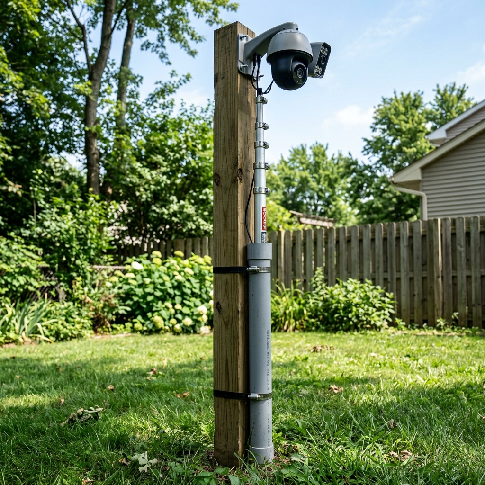

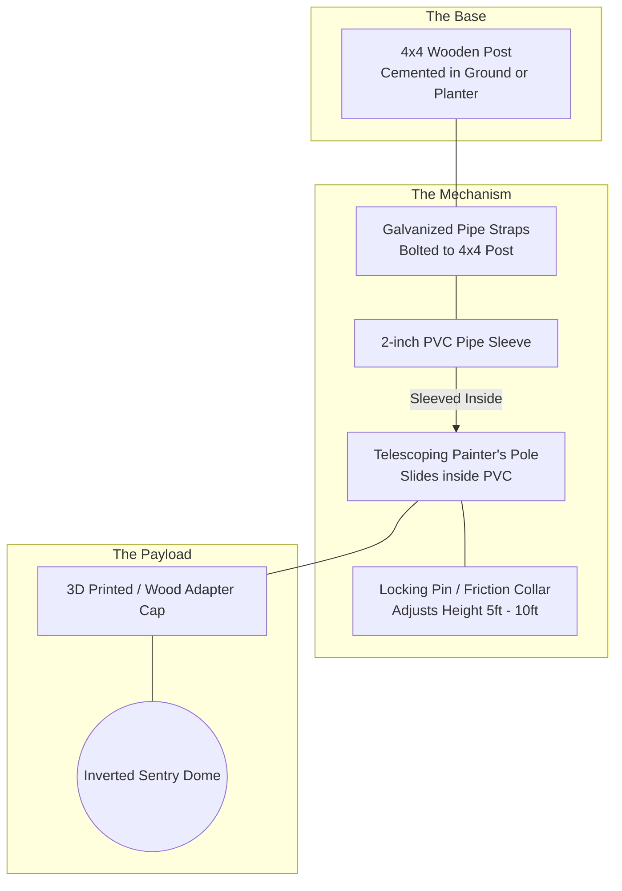
```mermaid
flowchart TD
    subgraph The Base
        A[4x4 Wooden Post\nCemented in Ground or Planter]
    end

    subgraph The Mechanism
        B[2-inch PVC Pipe Sleeve]
        C[Galvanized Pipe Straps\nBolted to 4x4 Post]
        D[Telescoping Painter's Pole\nSlides inside PVC]
        E[Locking Pin / Friction Collar\nAdjusts Height 5ft - 10ft]
    end

    subgraph The Payload
        F[3D Printed / Wood Adapter Cap]
        G((Inverted Sentry Dome))
    end

    A --- C
    C --- B
    B -->|Sleeved Inside| D
    D --- E
    D --- F
    F --- G
```

**Materials needed:** 4x4 Wooden Post (8ft), 2-inch PVC Pipe (4ft), Galvanized Pipe Straps, Telescoping Painter's Pole (or pool pole), Locking Pins.
* **Pros:** Extremely rigid base; cheap to build; hides wiring inside the PVC/Pole.
* **Cons:** Requires digging a post hole or building a heavy planter base.

---

## 2. The Cantilever Patio Umbrella Conversion
Since you mentioned an umbrella pole, the absolute best off-the-shelf solution for an inverted dome is an **Offset (Cantilever) Patio Umbrella**. You simply remove the fabric canopy and use the existing heavy-duty arm to hang the sentry.

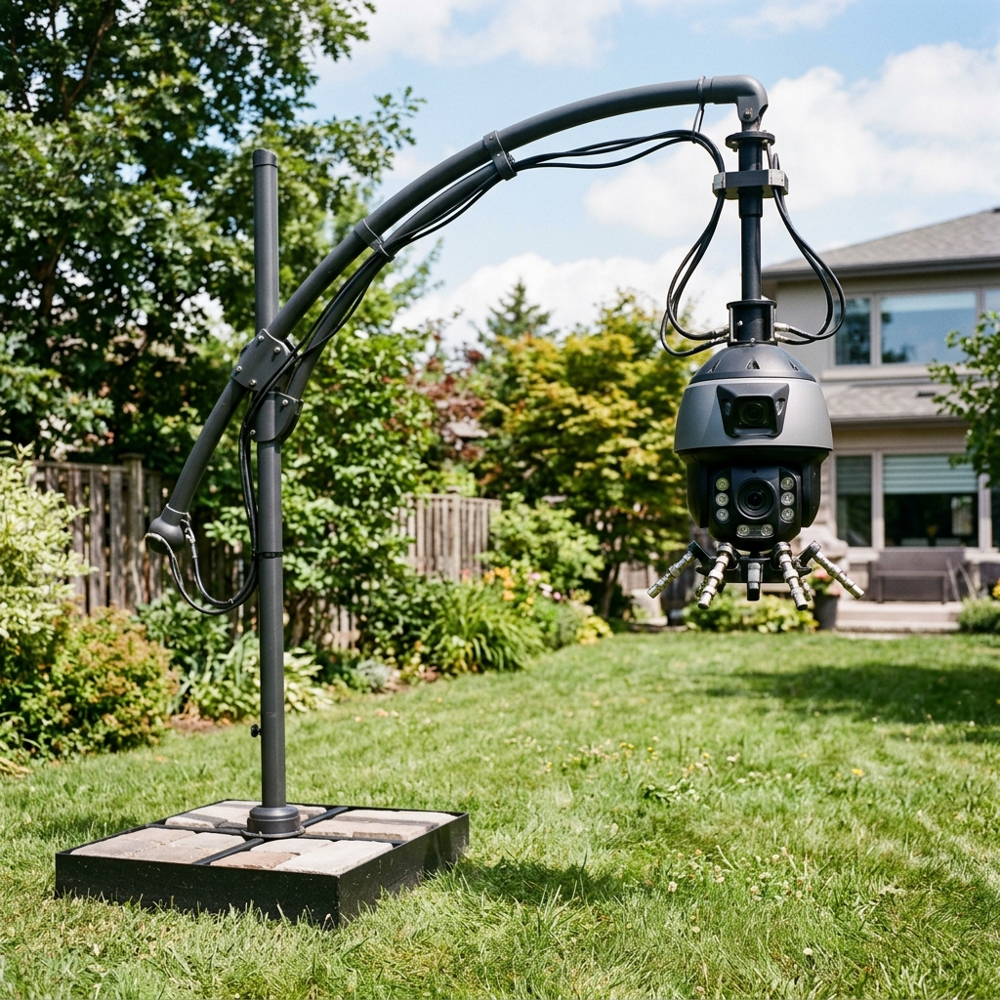

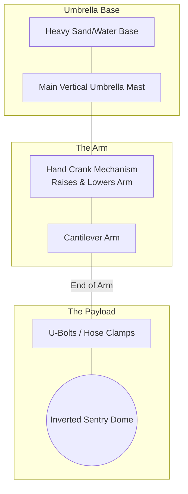
```mermaid
flowchart TD
    subgraph Umbrella Base
        A[Heavy Sand/Water Base]
        B[Main Vertical Umbrella Mast]
    end

    subgraph The Arm
        C[Cantilever Arm]
        D[Hand Crank Mechanism\nRaises & Lowers Arm]
    end

    subgraph The Payload
        E[U-Bolts / Hose Clamps]
        F((Inverted Sentry Dome))
    end

    A --- B
    B --- D
    D --- C
    C ---|End of Arm| E
    E --- F
```

**Materials needed:** Cantilever Patio Umbrella (with hand crank), Sand/Water filled base weights, U-Bolts.
* **Pros:** Zero building required; comes with a hand crank to easily raise/lower the height; easy to move around the yard.
* **Cons:** Has a large footprint on the ground.

---

## 3. The Husky Worklight Tripod
Home Depot sells heavy-duty telescoping LED worklights (like Husky brand) mounted on bright yellow tripods. These are built to withstand job site abuse, are highly portable, and telescope from ~3ft up to 7ft or more. 

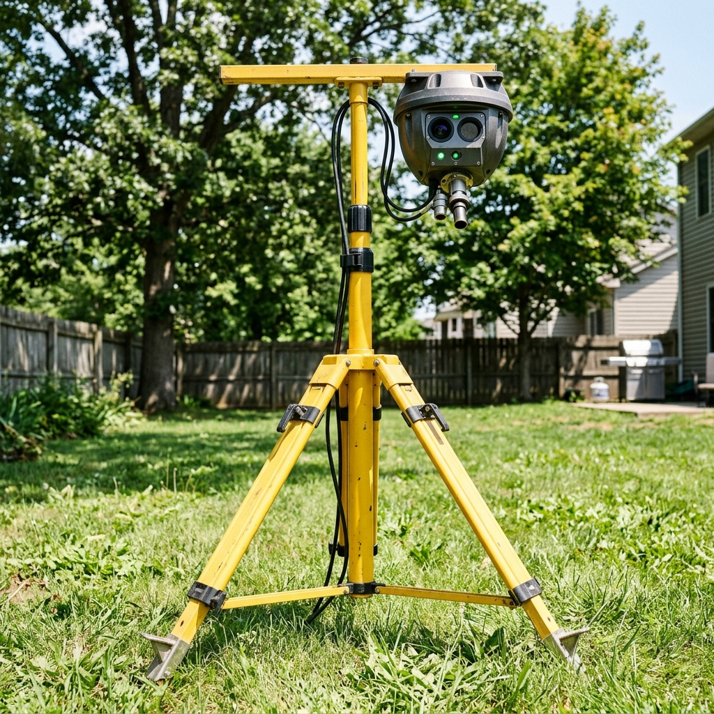

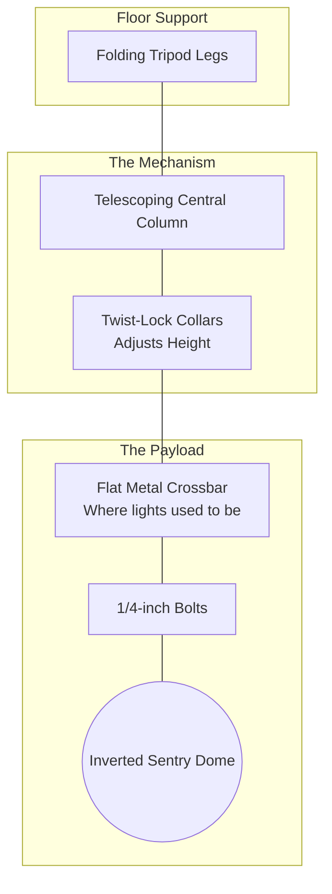
```mermaid
flowchart TD
    subgraph Floor Support
        A[Folding Tripod Legs]
    end

    subgraph The Mechanism
        B[Telescoping Central Column]
        C[Twist-Lock Collars\nAdjusts Height]
    end

    subgraph The Payload
        D[Flat Metal Crossbar\nWhere lights used to be]
        E[1/4-inch Bolts]
        F((Inverted Sentry Dome))
    end

    A --- B
    B --- C
    C --- D
    D --- E
    E --- F
```

**Materials needed:** Husky Telescoping Tripod (remove the lights), custom mounting plate.
* **Pros:** Ultimate portability; great for moving between indoor testing and outdoor deployment; collapses for storage.
* **Cons:** Max height is usually around 7-8 feet, which might be slightly shy of your 10-foot goal unless put on a table/deck.

---

## 4. The EMT Conduit "Gallows" Arm
If you already have a fence post, a wooden 4x4, or a deck railing, you can use EMT (Electrical Metallic Tube) conduit. A 1-inch thick EMT pipe is incredibly strong and cheap. You can use a conduit bender to create a 90-degree curve, creating a perfect hanging point.

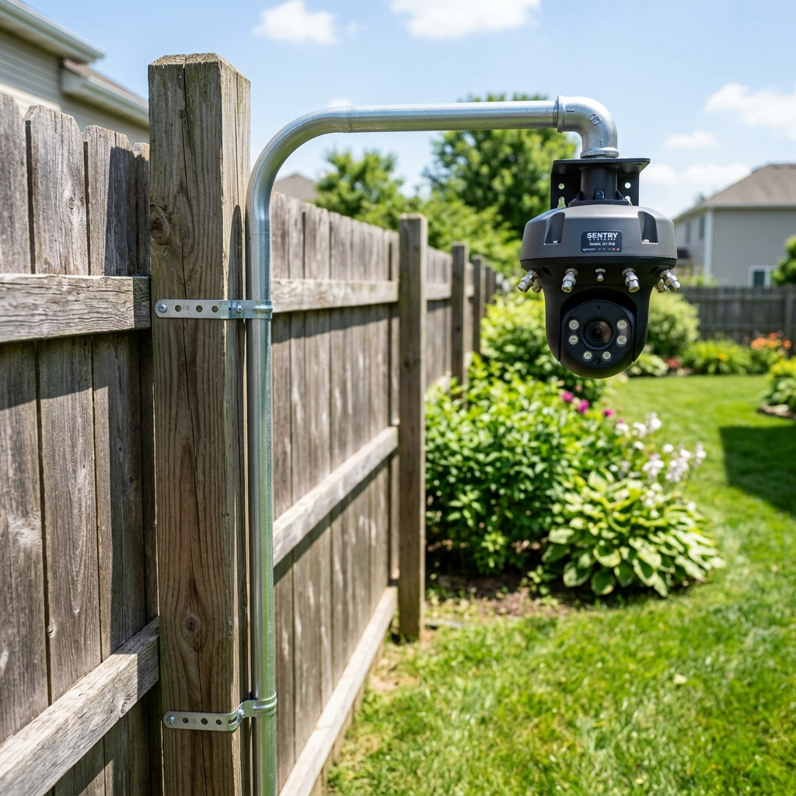

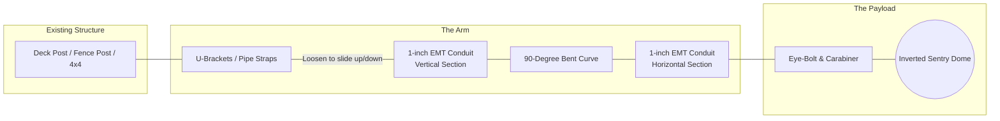
```mermaid
flowchart LR
    subgraph Existing Structure
        A[Deck Post / Fence Post / 4x4]
    end

    subgraph The Arm
        B[U-Brackets / Pipe Straps]
        C[1-inch EMT Conduit\nVertical Section]
        D[90-Degree Bent Curve]
        E[1-inch EMT Conduit\nHorizontal Section]
    end

    subgraph The Payload
        F[Eye-Bolt & Carabiner]
        G((Inverted Sentry Dome))
    end

    A --- B
    B ---|Loosen to slide up/down| C
    C --- D
    D --- E
    E --- F
    F --- G
```

**Materials needed:** 1-inch EMT Conduit (10ft), EMT Conduit Bender (can rent at Home Depot), U-Brackets / Straps.
* **Pros:** Very clean industrial look; height can be adjusted by loosening the pipe straps on the post and sliding the conduit up or down.
* **Cons:** Requires a conduit bender tool for a smooth curve.

---

## 5. The Zipline / Steel Wire Pulley System
Instead of a pole, hang the system from the sky. String a tensioned steel cable between two trees, your house, or existing 4x4 posts. The sentry dome hangs from a pulley carriage. 

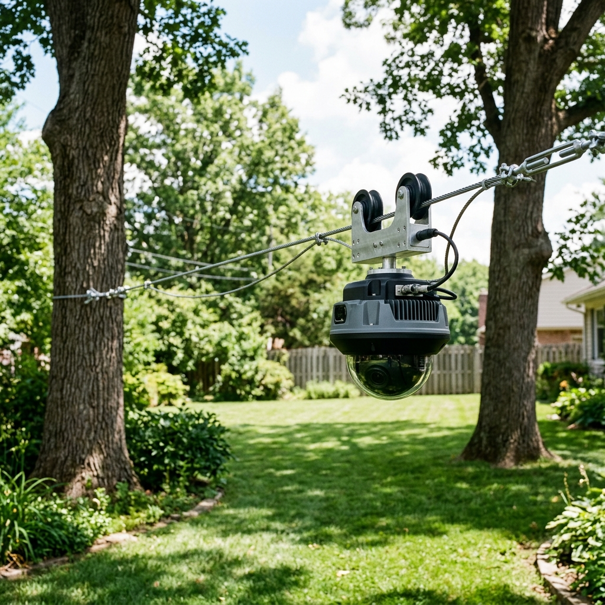

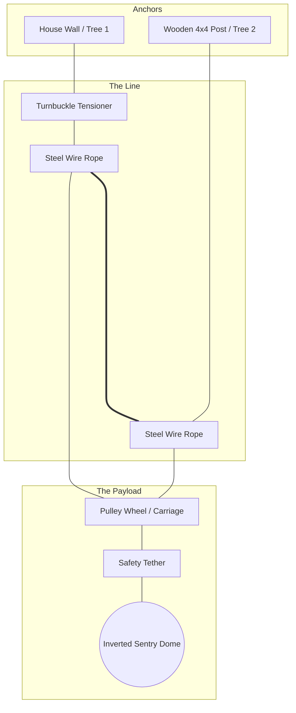
```mermaid
flowchart TD
    subgraph Anchors
        A[House Wall / Tree 1]
        B[Wooden 4x4 Post / Tree 2]
    end

    subgraph The Line
        C[Turnbuckle Tensioner]
        D===========================E
        D[Steel Wire Rope]
        E[Steel Wire Rope]
    end

    subgraph The Payload
        F[Pulley Wheel / Carriage]
        G[Safety Tether]
        H((Inverted Sentry Dome))
    end

    A --- C
    C --- D
    B --- E
    D --- F
    E --- F
    F --- G
    G --- H
```

**Materials needed:** 1/8" Steel Wire Rope, Turnbuckles, Wire Rope Clips, Pulley Wheel, Carabiners.
* **Pros:** Infinite positioning across the yard; covers a massive area; no poles blocking the ground space.
* **Cons:** Height is fixed once the cable is strung; requires strong anchor points to support the tension and weight.

---

# Part 2: The Portable & Height-Adjustable Series

If you need a system that can be easily moved inside for testing and outside for deployment, while maintaining full height adjustability (up to 10ft), here are 5 highly portable options:

## 6. The Professional C-Stand with Boom Arm
Photography C-stands are built to handle heavy studio equipment, have a tiny folding footprint, and telescope extremely high. The boom arm allows you to offset the turret.

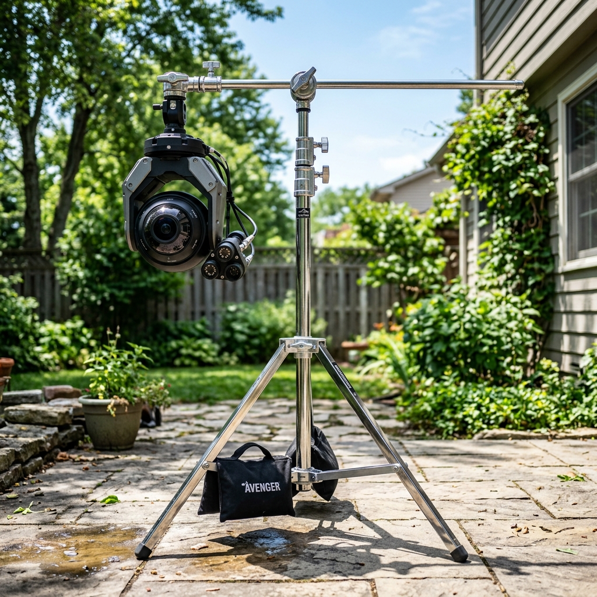

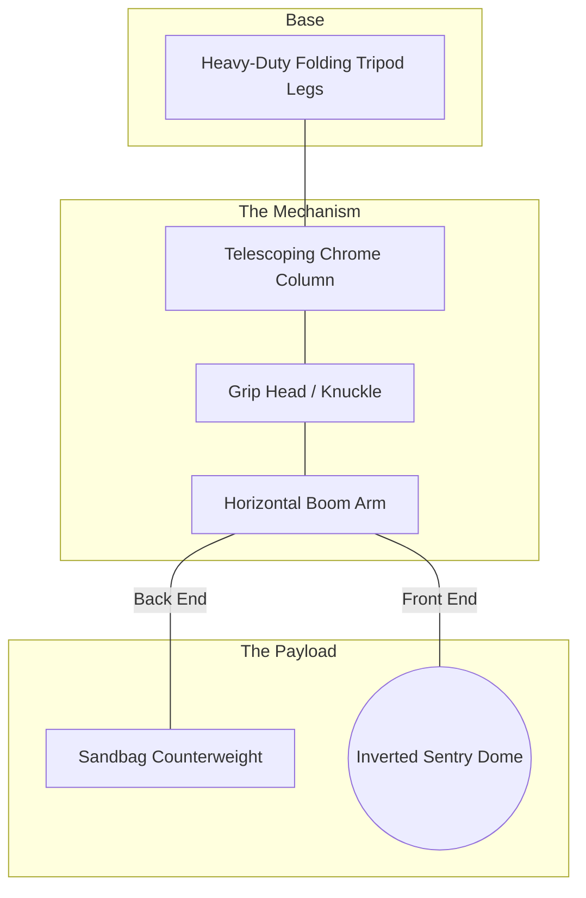
```mermaid
flowchart TD
    subgraph Base
        A[Heavy-Duty Folding Tripod Legs]
    end

    subgraph The Mechanism
        B[Telescoping Chrome Column]
        C[Grip Head / Knuckle]
        D[Horizontal Boom Arm]
    end

    subgraph The Payload
        E[Sandbag Counterweight]
        F((Inverted Sentry Dome))
    end

    A --- B
    B --- C
    C --- D
    D ---|Back End| E
    D ---|Front End| F
```

* **Pros:** Extremely professional look; folds completely flat; very portable; easily reaches 10ft.
* **Cons:** Requires a sandbag counterweight so it doesn't tip over.

---

## 7. The Deck Railing Telescoping Clamp
If you have a wooden deck or balcony overlooking your yard, you don't need a stand at all. Use a heavy-duty C-clamp to attach a telescoping pole directly to the railing.

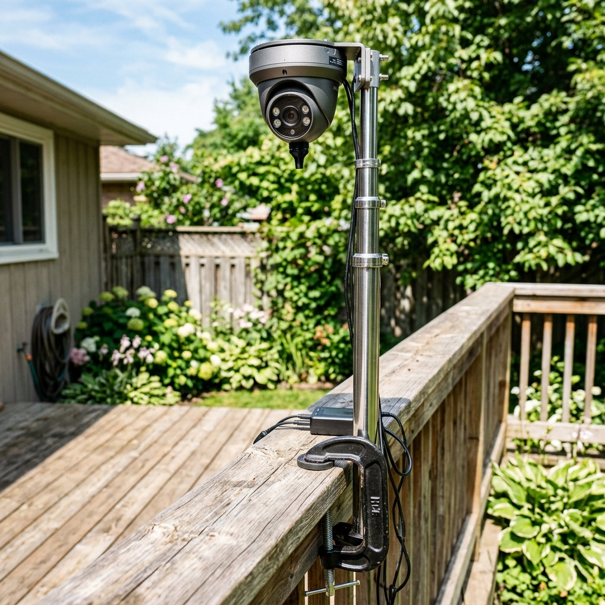

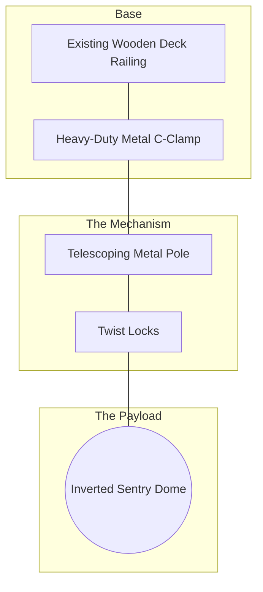
```mermaid
flowchart TD
    subgraph Base
        A[Existing Wooden Deck Railing]
        B[Heavy-Duty Metal C-Clamp]
    end

    subgraph The Mechanism
        C[Telescoping Metal Pole]
        D[Twist Locks]
    end

    subgraph The Payload
        E((Inverted Sentry Dome))
    end

    A --- B
    B --- C
    C --- D
    D --- E
```

* **Pros:** Zero footprint on the grass; attaches/detaches in 10 seconds; perfectly leverages existing structures for height.
* **Cons:** Limited to the perimeter of your deck.

---

## 8. The DJ Speaker Stand
Unlike heavy steel worklights, aluminum DJ speaker stands are incredibly lightweight and designed specifically for rapid teardown and transport.

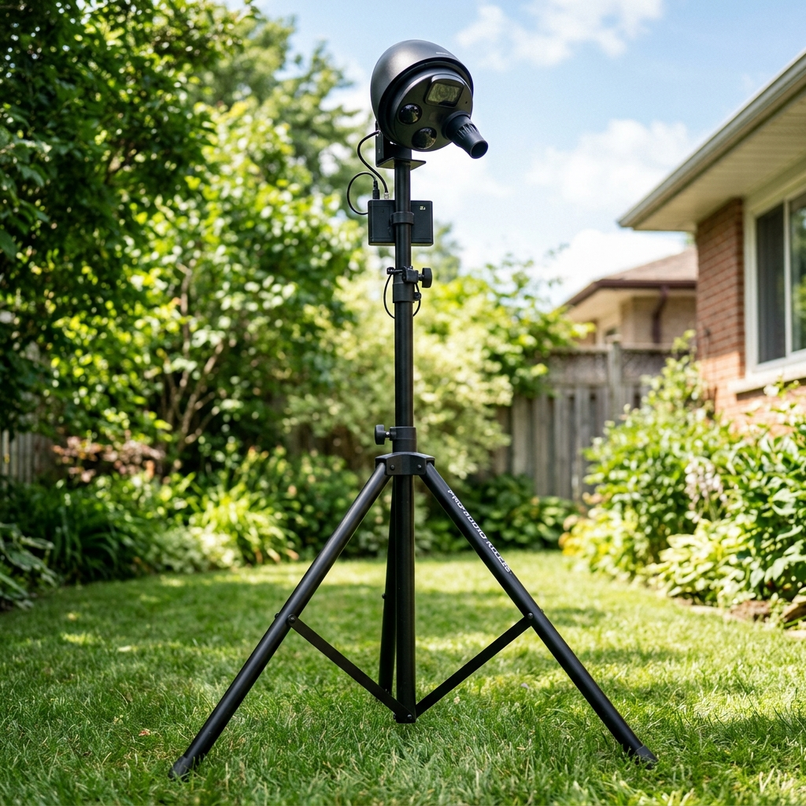

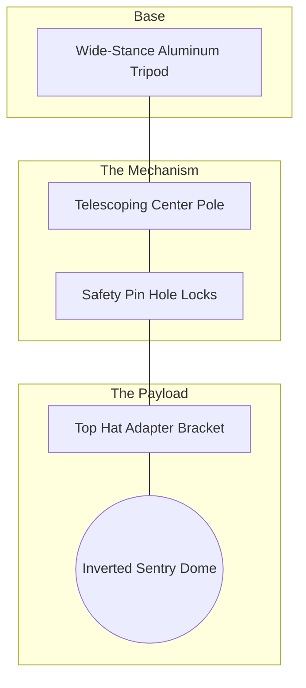
```mermaid
flowchart TD
    subgraph Base
        A[Wide-Stance Aluminum Tripod]
    end

    subgraph The Mechanism
        B[Telescoping Center Pole]
        C[Safety Pin Hole Locks]
    end

    subgraph The Payload
        D[Top Hat Adapter Bracket]
        E((Inverted Sentry Dome))
    end

    A --- B
    B --- C
    C --- D
    D --- E
```

* **Pros:** Extremely lightweight (easy to carry inside with one hand); safety pins prevent the pole from slipping down.
* **Cons:** Wide tripod footprint on the grass.

---

## 9. The Rolling "Suitcase" Water Base
Similar to a portable basketball hoop base or a commercial street sign, this plastic base can be filled with water or sand for massive stability, but easily tipped and rolled on its wheels.

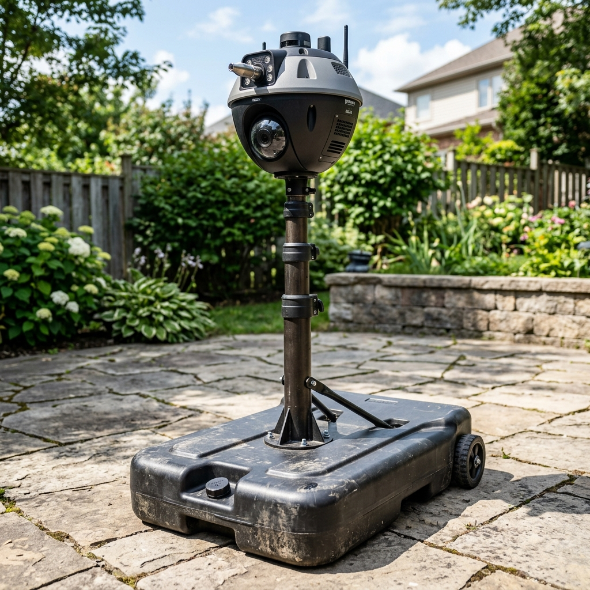

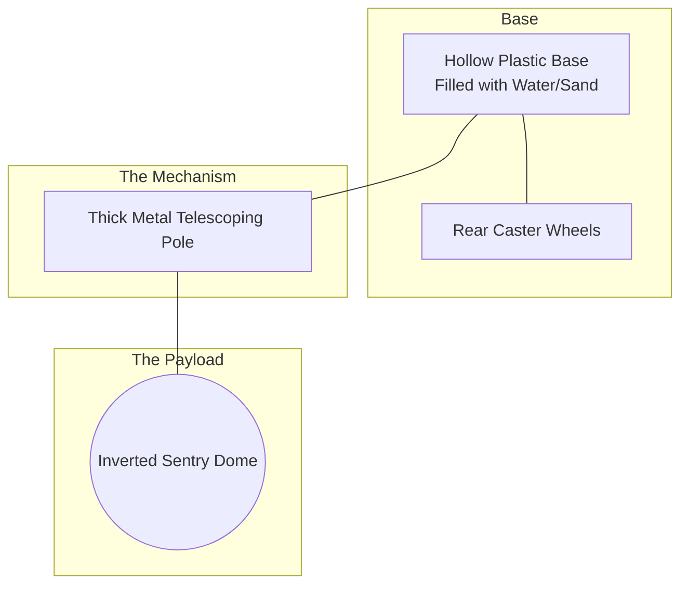
```mermaid
flowchart TD
    subgraph Base
        A[Hollow Plastic Base\nFilled with Water/Sand]
        B[Rear Caster Wheels]
    end

    subgraph The Mechanism
        C[Thick Metal Telescoping Pole]
    end

    subgraph The Payload
        D((Inverted Sentry Dome))
    end

    A --- B
    A --- C
    C --- D
```

* **Pros:** Ultimate stability (wind won't knock it down); very easy to roll around the patio or into the garage.
* **Cons:** The base is bulky and heavy when filled; harder to roll across thick grass compared to pavement.

---

## 10. The Tailgate "Drive-Under" Tire Mount
A brilliantly simple solution: a flat metal plate that you simply park your car tire on top of. A telescoping flagpole extends up from the plate. It uses the 3,000lb weight of your car as the anchor!

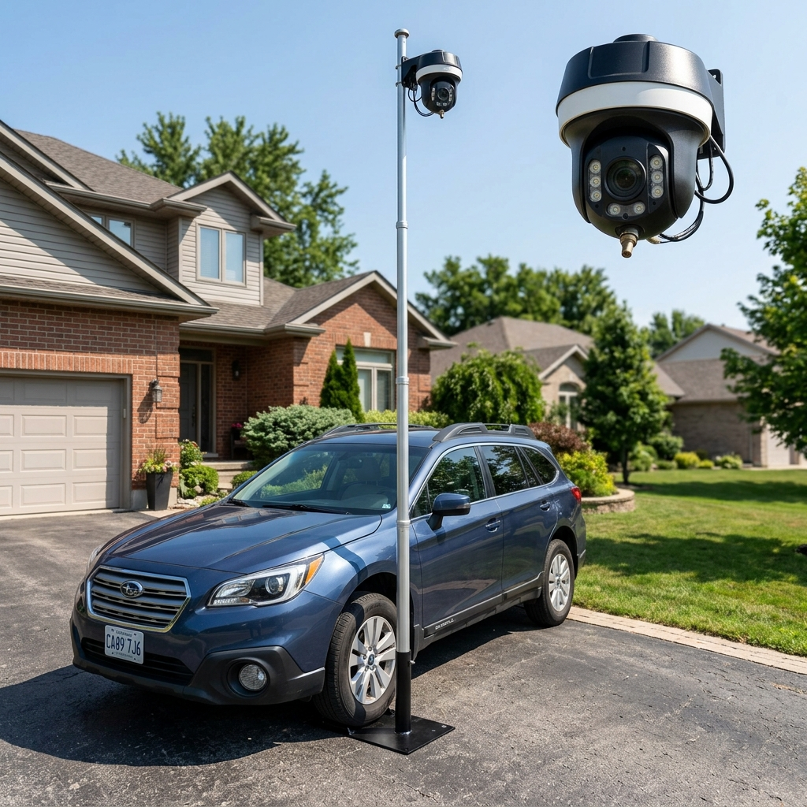

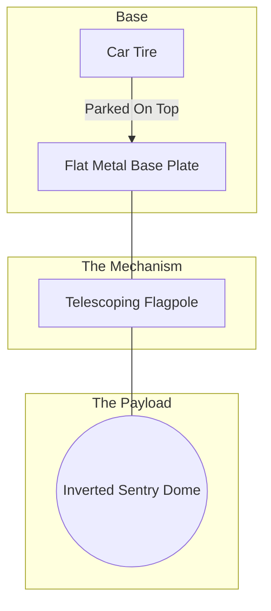
```mermaid
flowchart TD
    subgraph Base
        A[Car Tire]
        B[Flat Metal Base Plate]
    end

    subgraph The Mechanism
        C[Telescoping Flagpole]
    end

    subgraph The Payload
        D((Inverted Sentry Dome))
    end

    A -->|Parked On Top| B
    B --- C
    C --- D
```

* **Pros:** Unbeatable stability without digging holes or carrying sandbags; highly portable (just pick up the plate when the car moves).
* **Cons:** Requires a vehicle or extremely heavy object to sit on the base plate; limits deployment strictly to the driveway/garage.

---

# Part 3: The Weatherproof Inverted Series

To make this fully weatherproof for a permanent outdoor setup, the equipment must be protected from the rain. This changes the architectural design from an upright turret to a **"Hanging Dome"** approach. The Jetson and pump sit in the protected upper base (acting as the umbrella), and the gimbal hangs downward.

Here are two updated mounting concepts designed specifically for an inverted, weatherproof dome setup:

## 11. The "Inverted Gallows" Telescoping Post
This is an updated "Post and Sleeve" design. Instead of a generic telescoping pole inside a post, use heavy-duty industrial pipe clamps to slide a strong EMT conduit arm up and down the main 4x4 wooden post. A 90-degree bend at the top of the conduit creates the hanging point for the inverted dome sentry.

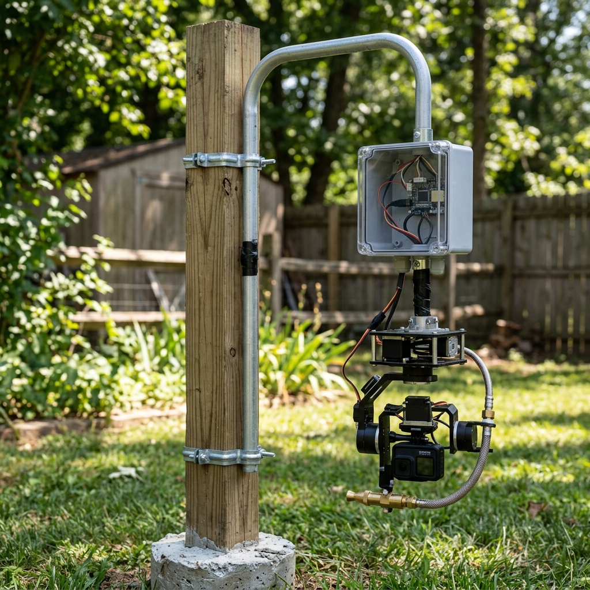

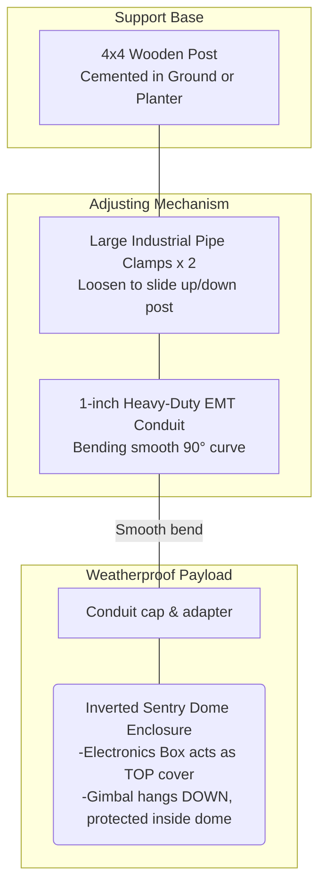
```mermaid
flowchart TD
    subgraph Support Base
        A[4x4 Wooden Post\nCemented in Ground or Planter]
    end

    subgraph Adjusting Mechanism
        B[1-inch Heavy-Duty EMT Conduit\nBending smooth 90° curve]
        C[Large Industrial Pipe Clamps x 2\nLoosen to slide up/down post]
    end

    subgraph Weatherproof Payload
        D[Conduit cap & adapter]
        E(Inverted Sentry Dome Enclosure\n-Electronics Box acts as TOP cover\n-Gimbal hangs DOWN, protected inside dome)
    end

    A --- C
    C --- B
    B ---|Smooth bend| D
    D --- E
```

* **Pros:** Extremely rigid; uses standard industrial hardware; height is fully adjustable (e.g., from 5ft to 10ft) by sliding the conduit arm.
* **Cons:** Requires a conduit bender tool for a smooth 90-degree curve.

---

## 12. The Inverted Cantilever Umbrella Conversion
Since we want to hang the turret like a dome, the absolute best off-the-shelf solution is an offset (cantilever) patio umbrella. You keep the heavy base and the main mast/arm, but remove the fabric canopy. Your inverted sentry dome will hang directly where the umbrella was, protected by its own weather shield.

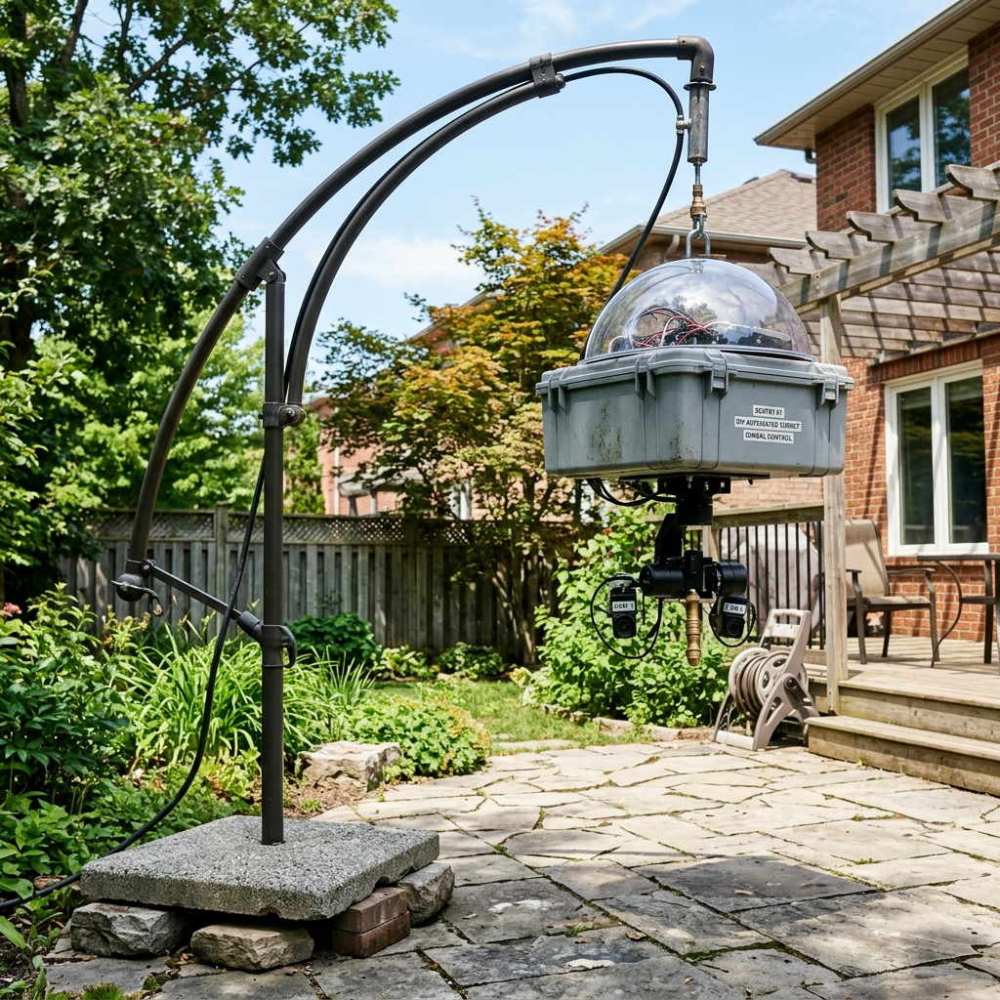

```mermaid
flowchart TD
    subgraph Umbrella Base
        A[Heavy Sand/Water-Filled Base Weights]
        B[Main Vertical Umbrella Mast]
    end

    subgraph Adjusting Arm
        C[Offset Cantilever Arm]
        D[Hand Crank Mechanism\n(Original part, fully functional)]
    end

    subgraph Weatherproof Payload
        E[U-Bolts / Hose Clamps]
        F(Inverted Sentry Dome Enclosure\n-Electronics Box acts as TOP cover\n-Gimbal hangs DOWN, protected inside dome)
    end

    A --- B
    B --- D
    D --- C
    C ---|End of Arm| E
    E --- F
```

* **Pros:** Zero building required; comes with a hand crank to easily raise and lower the sentry dome; portable with its own heavy base.
* **Cons:** Large physical footprint on the ground.
