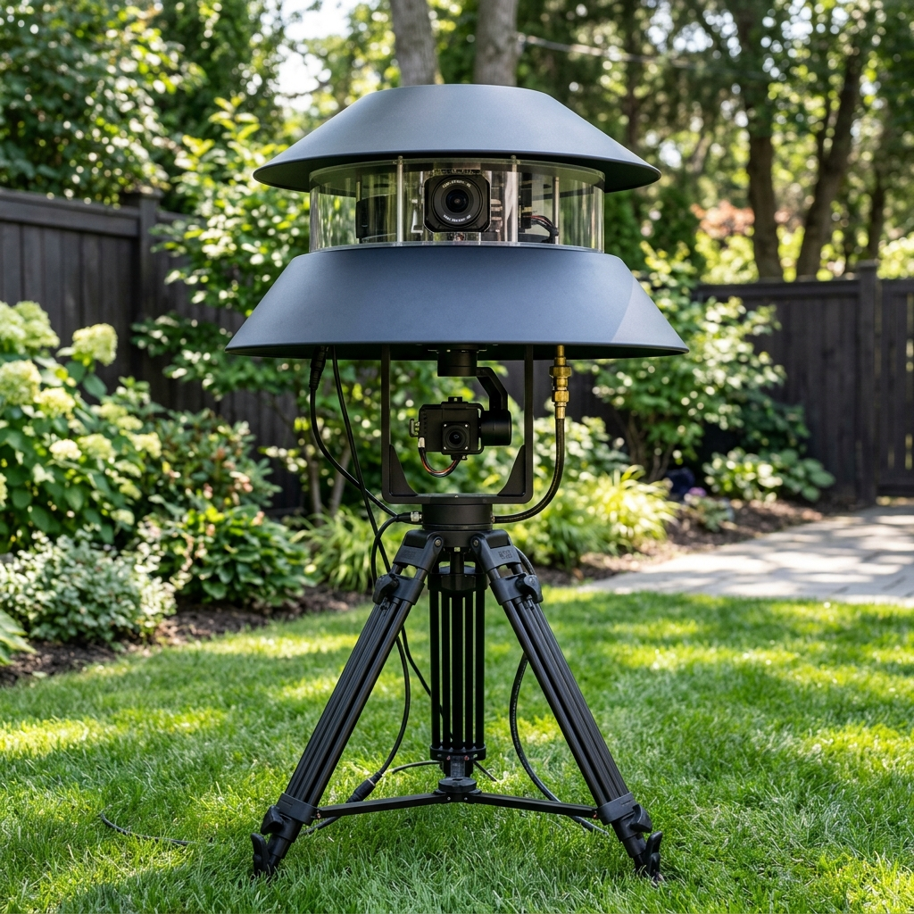
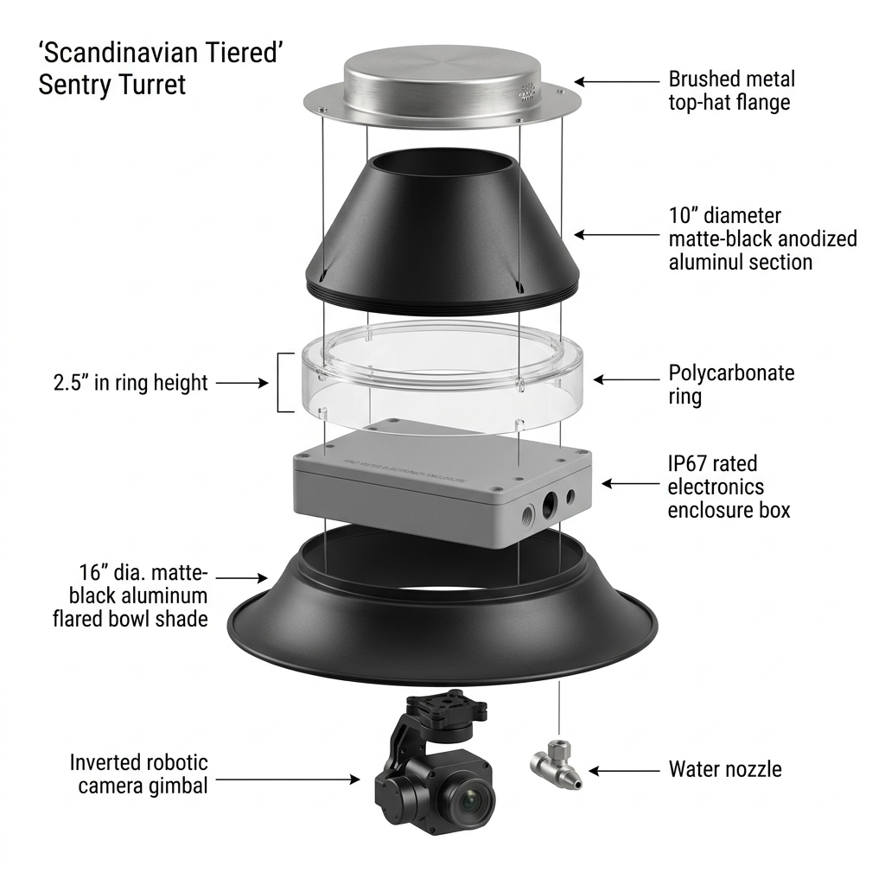
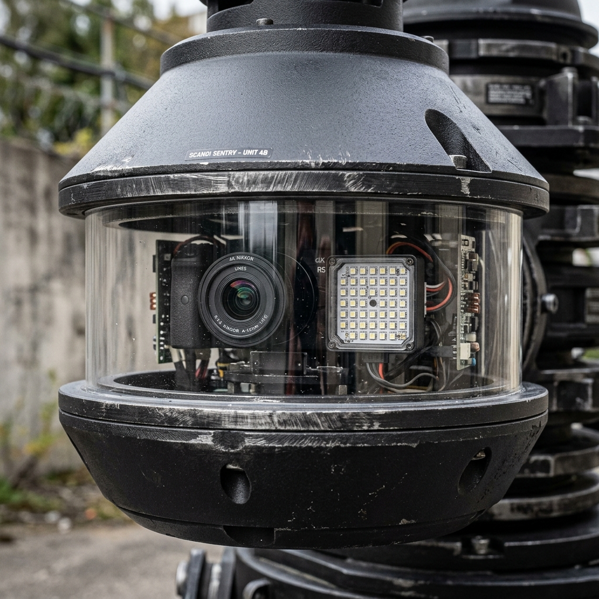
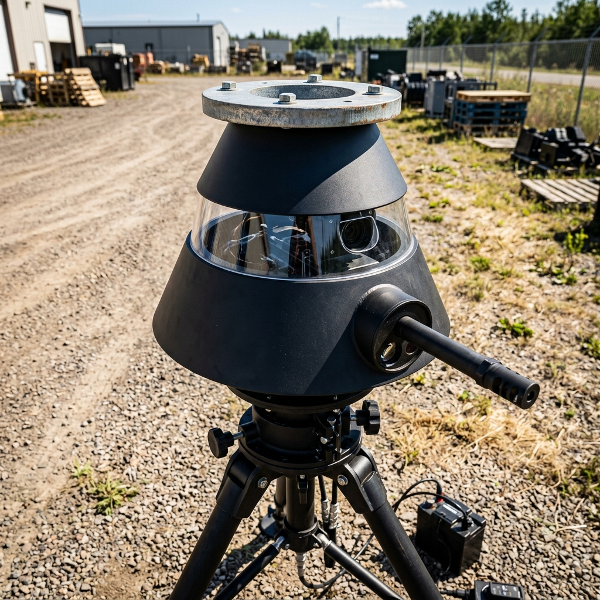
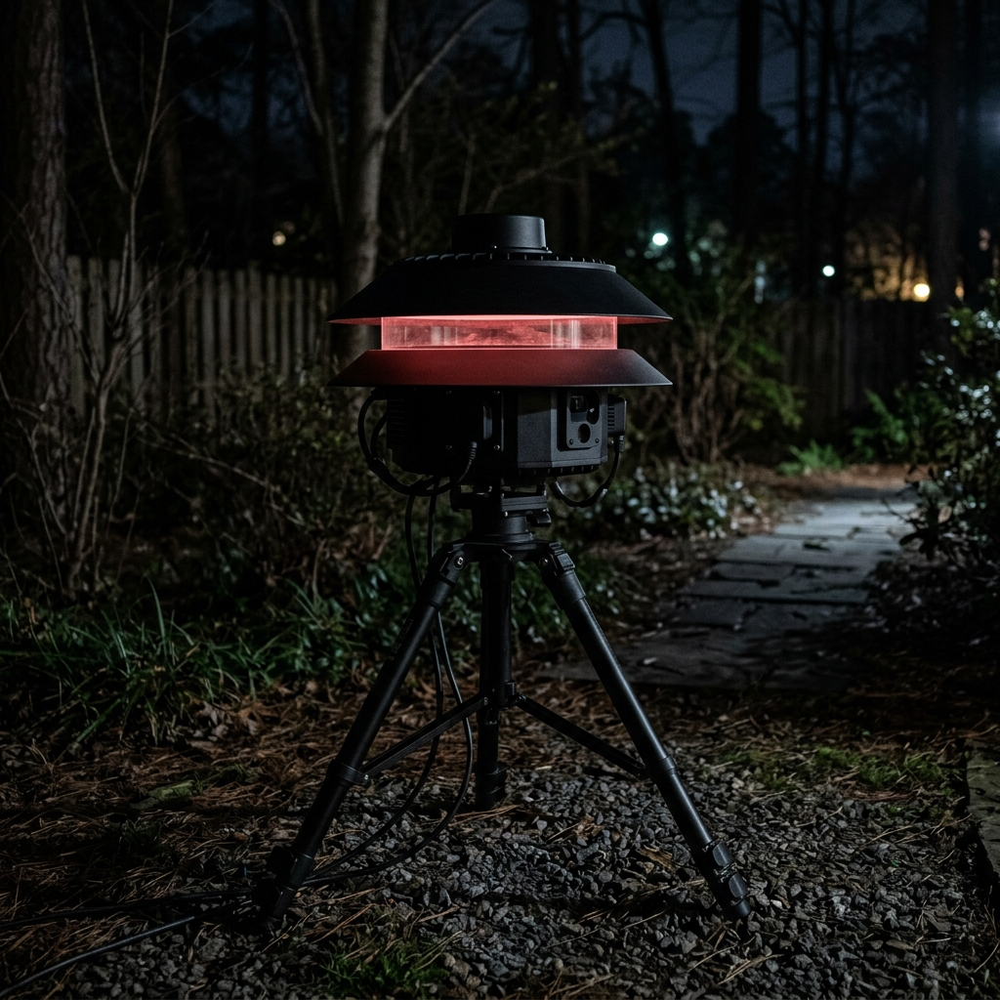
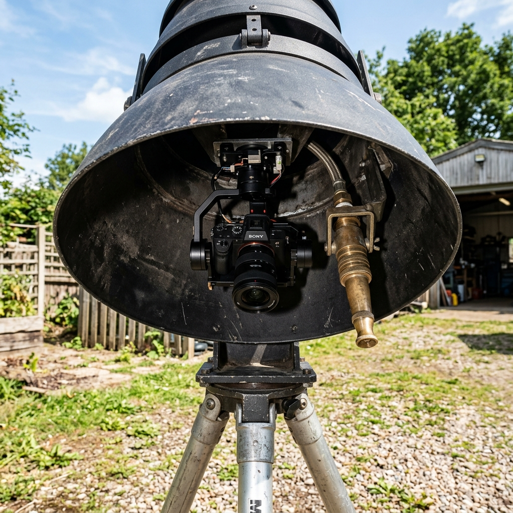
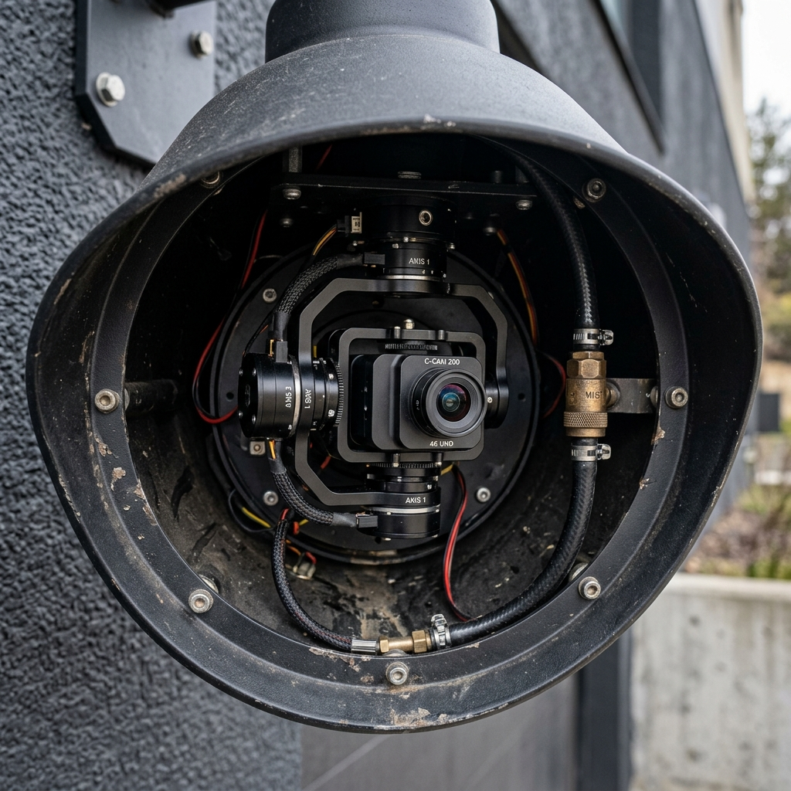

# HW-002: Scandinavian Tiered Canopy Build Guide

**Implements:** HW-001 §2.3 (Enclosure Architecture)
**Status:** Approved for Prototyping

This document outlines the detailed hardware specifications and assembly process for the final "Scandinavian Tiered" canopy enclosure for the DropMosquitoes Sentry Turret. This design utilizes off-the-shelf commercial components to create a highly weatherproof, aesthetically premium housing that preserves a 360-degree panoramic view for tracking sensors.

---

## 1. Architectural Overview

The enclosure is built on a vertical suspension stack. It features three distinct tiers:
1. **The Attic (10" Cone):** Houses the main mounting flange and cable routing.
2. **The Optical Gap (2.5" Clear Band):** A continuous 360-degree clear polycarbonate window housing the stationary Scout Camera and 850nm IR Illuminator.
3. **The Mechanical Skirt (16" Flared Bowl):** A deep, opaque lower umbrella that completely shields the hanging Storm32 gimbal and Jetson electronics from wind-driven rain and direct solar heat.

### Front Profile View

### Exploded Architecture

---

## 2. Bill of Materials (BOM)

All structural components can be sourced directly from local hardware retailers (e.g., Home Depot, Lowe's) or online commercial lighting distributors (e.g., Amazon, Grainger).

### Primary Outer Shells (Amazon / Lighting Supplier)
* **1x 10-inch Matte Black Aluminum Cone Pendant Shade** (Must have a flat upper mounting surface).
* **1x 16-inch Matte Black Aluminum Flared Bowl Pendant Shade**.

### Core Suspension Hardware (Home Depot)
* **4x 1/4"-20 Threaded Steel Rods** (12 inches length).
* **16x 1/4"-20 Nylon Lock Nuts** (To prevent loosening from vibration).
* **16x 1/4" Neoprene Bonded Sealing Washers** (To waterproof the bolt holes).
* **1x Ultimate Support TSM-150MK Top-Hat Flange** (35mm inner diameter).

### Weather Sealing & Optics (Home Depot)
* **1x Sheet of Clear Lexan/Polycarbonate** (0.060" or 1/16" thickness, minimum 36" length for curving).
* **1x Tube of Clear Exterior-Grade 100% Silicone Sealant**.
* **1x Roll of 3M VHB Double-Sided Foam Tape** (For securing the Jetson tray).

---

## 3. Assembly Instructions

### Step 1: Prepping the Optical Gap
The defining feature of this architecture is the clear optical gap between the two metal shades.

1. Cut the clear Lexan sheet into a single 3-inch wide strip (the extra 0.5 inch is for an internal lip).
2. Curve the Lexan strip into a cylinder with an exact 10-inch outer diameter (matching the base of the upper cone).
3. Use a bead of clear silicone to join the seam of the cylinder.

### Step 2: Drilling the Suspension Points
The entire assembly hangs on four threaded rods.

1. Mark four evenly spaced holes on the flat top of the 10-inch cone shade.
2. Match these four holes exactly on the flat top of the 16-inch flared bowl shade, and on the corners of the internal Jetson mounting tray (IP67 Box lid).
3. Drill 1/4" holes at all marked locations.

### Step 3: Stacking the Core
The assembly is built from the top down.

1. Bolt the **TSM-150MK Top-Hat Flange** to the top of the 10-inch cone.
2. Thread the four 1/4"-20 rods down through the cone, securing them with lock nuts and rubber sealing washers on both sides of the metal.
3. Slide the 10-inch Lexan cylinder up *inside* the lip of the top cone. Secure with silicone.
4. Mount the Scout Camera and IR Illuminator onto the internal Jetson tray, ensuring they face outward.
5. Slide the Jetson tray up the four threaded rods until it rests tightly against the bottom edge of the Lexan cylinder. Lock it in place with nuts and washers.

### Night Operations (Active IR Tracking)
The Lexan gap allows the 850nm IR illuminator to cast a wide field without blinding the lower cameras or reflecting off metal surfaces.

### Step 4: The Mechanical Skirt
The final step protects the moving gimbal.

1. Slide the large 16-inch flared bowl shade up the four threaded rods until it sits flat against the bottom of the Jetson tray.
2. Secure the shade with the final set of nylon lock nuts and rubber washers.
3. Bolt the Storm32 Gimbal directly to the *underside* of the Jetson tray, allowing it to hang freely inside the hollow cavity of the 16-inch skirt.

The deep skirt ensures that rain cascading off the upper tiers drips straight down to the ground, entirely missing the sensitive copper coils of the brushless gimbal motors.
