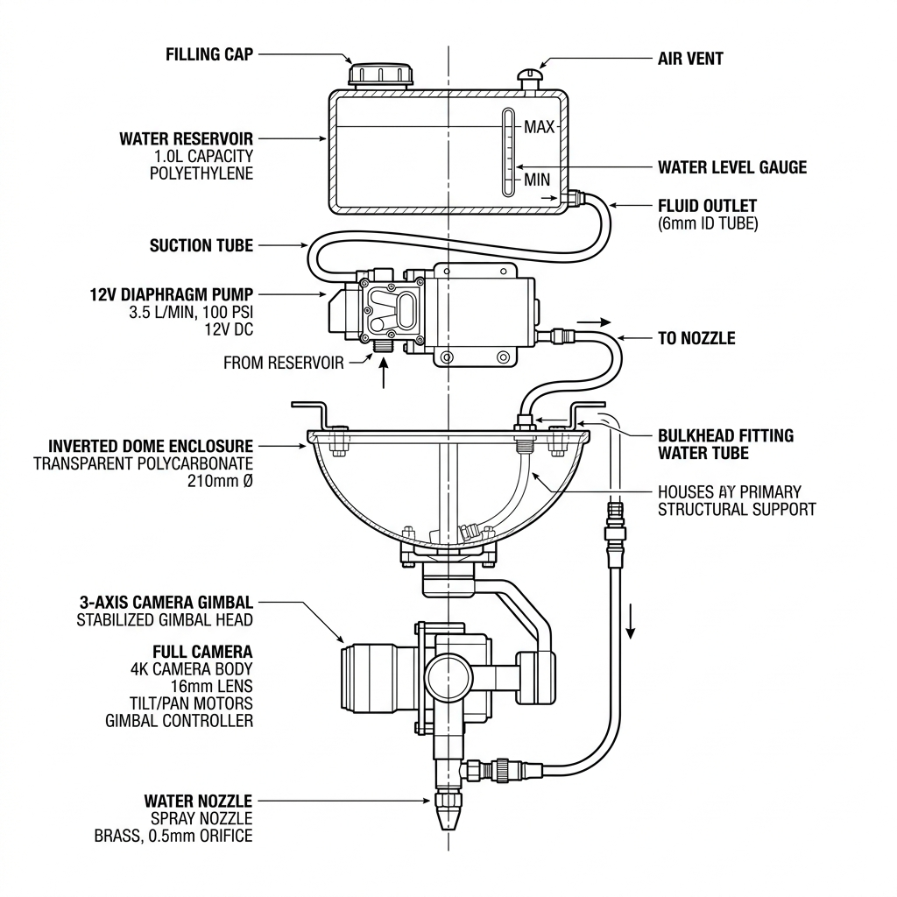
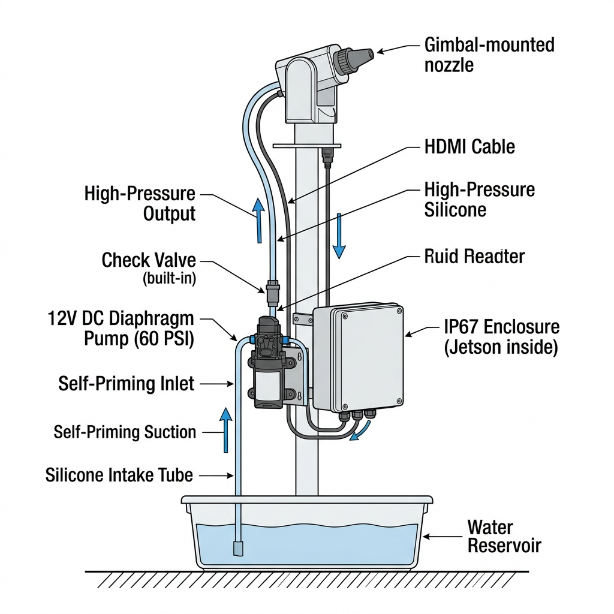
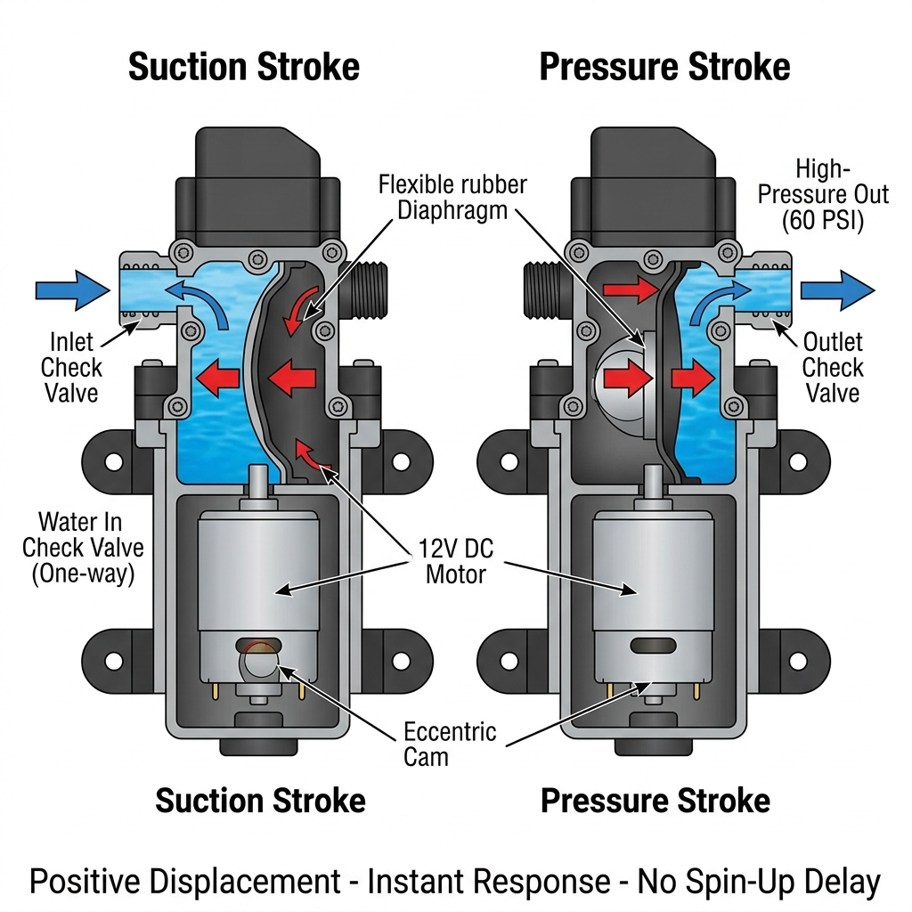

# OPS-001: Operations & Deployment Guide

**Status:** DRAFT  
**Version:** 1.0  
**Last Updated:** 2026-05-15  
**Owner:** Salman

> This guide walks through every stage of the project lifecycle — from unboxing parts to daily operation. Follow it in order.

---

## Phase 1: Procurement & Inspection

### 1.1 Order Parts
Purchase everything in [parts.csv](../../parts.csv). Cross-reference with [HW-001](HW-001-hardware-spec.md) §12.

### 1.2 Incoming Inspection
When parts arrive, verify:
- [ ] Yahboom Jetson Orin Nano SUPER powers on and boots to JetPack desktop
- [ ] Both CSI→HDMI kits contain: TX board, RX board, FPC ribbon cable, 15→22 adapter
- [ ] OV9281 + IMX219 cameras have matching 15-pin FPC connectors
- [ ] Monk Makes relay has 2 independent channels with screw terminals
- [ ] Storm32 gimbal arms swing freely with no mechanical binding
- [ ] Orbit nozzle threads into the 1/4" tubing barb tightly
- [ ] 1N4007 diodes received (for flyback protection — HW-001 §6.1)

---

## Phase 2: Jetson Initial Setup (Before Assembly)

Do this on a desk with a monitor, keyboard, and mouse connected to the Yahboom kit.

### 2.1 First Boot
1. Connect Yahboom kit to monitor via HDMI, plug in USB keyboard + mouse
2. Power on with the 12V barrel jack
3. Complete the JetPack 6.0 Ubuntu setup wizard (username: `jetson`, password: your choice)

### 2.2 WiFi Setup
The Yahboom carrier has an onboard WiFi/BT module.

```bash
# List available networks
nmcli device wifi list

# Connect to your home WiFi
nmcli device wifi connect "YourNetworkName" password "YourPassword"

# Verify connection
ip addr show wlan0
# Note the IP address (e.g., 192.168.0.50)
```

### 2.3 Assign Static IP (Recommended)
So the dashboard URL doesn't change every boot:

```bash
# Find your connection name
nmcli connection show

# Set static IP (adjust for your network)
sudo nmcli connection modify "YourNetworkName" \
  ipv4.method manual \
  ipv4.addresses 192.168.0.100/24 \
  ipv4.gateway 192.168.0.1 \
  ipv4.dns "8.8.8.8,8.8.4.4"

# Restart networking
sudo nmcli connection down "YourNetworkName"
sudo nmcli connection up "YourNetworkName"
```

### 2.4 Enable SSH (for headless access)
```bash
sudo systemctl enable ssh
sudo systemctl start ssh
```

From your dev machine, verify: `ssh jetson@192.168.0.100`

### 2.5 Maximize Performance
```bash
sudo nvpmodel -m 0
sudo jetson_clocks
```

### 2.6 Install Python Dependencies
```bash
pip install ultralytics onnx pyserial smbus2 flask numpy
```

### 2.7 Deploy Code (First Time)
From your dev machine (Mac/Windows):
```bash
# Edit deploy.sh to set your Jetson's IP
export JETSON_HOST=192.168.0.100
./deploy.sh
```

Or manually:
```bash
scp -r ./* jetson@192.168.0.100:/home/jetson/dropMosquitoes/
```

### 2.8 Install Systemd Service
```bash
ssh jetson@192.168.0.100
cd /home/jetson/dropMosquitoes
sudo cp sentry.service /etc/systemd/system/
sudo systemctl daemon-reload
sudo systemctl enable sentry.service
# Don't start yet — hardware isn't connected
```

---

## Phase 3: Hardware Assembly

> **Assembly order matters.** Test each subsystem before closing the enclosure.
> Open the relevant wiring diagram for each step before you start.

### 3.0 Reference Diagrams

Keep these open during assembly (all in `diagrams/` directory):

| Diagram | Use During Steps |
|---------|------------------|
| [assembly_1_topdown.drawio](../../diagrams/assembly_1_topdown.drawio) | Overall layout — top-down view of enclosure |
| [assembly_2_sideview.drawio](../../diagrams/assembly_2_sideview.drawio) | Side profile — mounting heights and clearances |
| [assembly_3_gimbal.drawio](../../diagrams/assembly_3_gimbal.drawio) | Gimbal mount detail |
| [gimbal_payload.drawio](../../diagrams/gimbal_payload.drawio) | Camera + nozzle placement on gimbal plate |
| [wire_11_terminal_block_hub.drawio](../../diagrams/wire_11_terminal_block_hub.drawio) | IDC40P breakout — master wiring reference |
| [arch_11_software_v2.drawio](../../diagrams/arch_11_software_v2.drawio) | Software architecture (for understanding data flow) |

**ECO-2026-003 Updated Images:**







### 3.1 Assembly Sequence

| Step | Task | Test Before Proceeding | Diagram |
|------|------|----------------------|---------|
| 1 | Mount Wago 221-415 blocks inside IP67 enclosure | Visual — levers click shut | [zone1_power](../../diagrams/zone1_power.drawio) |
| 2 | Wire 12V DC pigtail → Wago +12V port 1, GND port 1 | Multimeter: 12V across Wago ports | [wire_01_power_entry](../../diagrams/wire_01_power_entry.drawio) |
| 3 | Wire Yahboom barrel jack to Wago +12V/GND ports 2 | Jetson boots | [wire_02_jetson_power](../../diagrams/wire_02_jetson_power.drawio) |
| 4 | Connect 40-pin ribbon cable to Jetson GPIO header | `gpio readall` or `cat /sys/class/gpio/` | [wire_09_gpio_pinout](../../diagrams/wire_09_gpio_pinout.drawio) |
| 5 | Route ribbon cable out of Yahboom case, seal Yahboom lid | Ribbon cable exits cleanly | [wire_11_terminal_block_hub](../../diagrams/wire_11_terminal_block_hub.drawio) |
| 6 | Mount IDC40P terminal breakout in IP67 enclosure | Ribbon cable connects, terminals accessible | [wire_11_terminal_block_hub](../../diagrams/wire_11_terminal_block_hub.drawio) |
| 7 | Wire Monk Makes relay to IDC40P (§5.3 in HW-001) | `python3 -c "import Jetson.GPIO as GPIO; ..."` relay clicks | [wire_03_relay_pump](../../diagrams/wire_03_relay_pump.drawio) |
| 8 | Solder 1N4007 flyback diode across pump terminals | Visual — cathode stripe toward +12V | [wire_03_relay_pump](../../diagrams/wire_03_relay_pump.drawio) |
| 9 | Wire pump to relay CH1 NO contact + Wago GND | Relay trigger → pump runs | [wire_03_relay_pump](../../diagrams/wire_03_relay_pump.drawio) |
| 10 | Mount Scout camera (OV9281) to enclosure lid | `v4l2-ctl --list-devices` shows /dev/video0 | [wire_07_camera_csi_chain](../../diagrams/wire_07_camera_csi_chain.drawio) |
| 11 | Connect Scout CSI chain → Jetson Port 0 | `gst-launch-1.0 nvarguscamerasrc sensor-id=0 ! fakesink` | [wire_07_camera_csi_chain](../../diagrams/wire_07_camera_csi_chain.drawio) |
| 12 | Mount Storm32 gimbal to pole/bracket | Manual — arms swing freely | [assembly_3_gimbal](../../diagrams/assembly_3_gimbal.drawio) |
| 13 | Wire gimbal to relay CH2 + Wago + UART (IDC40P terminals) | Power on → gimbal calibrates | [wire_04_relay_gimbal](../../diagrams/wire_04_relay_gimbal.drawio), [wire_05_gimbal_serial](../../diagrams/wire_05_gimbal_serial.drawio) |
| 14 | Mount Sniper camera (IMX219) to gimbal payload | Firmly seated on payload plate | [gimbal_payload](../../diagrams/gimbal_payload.drawio) |
| 15 | Mount Orbit nozzle on gimbal payload | Angle matches camera boresight | [gimbal_payload](../../diagrams/gimbal_payload.drawio) |
| 16 | Run Sniper CSI chain (Camera → TX → FPV HDMI → RX → Jetson Port 1) | `gst-launch-1.0 nvarguscamerasrc sensor-id=1 ! fakesink` | [wire_07_camera_csi_chain](../../diagrams/wire_07_camera_csi_chain.drawio) |
| 17 | Connect tubing: pump → check valve → tubing → nozzle | Manual pump test, check for leaks | [wire_08_fluid_path](../../diagrams/wire_08_fluid_path.drawio), [zone3_fluid](../../diagrams/zone3_fluid.drawio) |
| 18 | Wire TF-Luna LiDAR to IDC40P (I2C) | `i2cdetect -y 1` shows address 0x10 | [wire_06_lidar_i2c](../../diagrams/wire_06_lidar_i2c.drawio) |
| 19 | Mount IR illuminators to fixed post (NOT gimbal) | Power on, check with phone camera (IR visible on phone) | [wire_10_ir_illuminator](../../diagrams/wire_10_ir_illuminator.drawio) |
| 20 | Seal all cable glands with silicone | IP67 integrity | [wire_12_enclosure_glands](../../diagrams/wire_12_enclosure_glands.drawio) |

### 3.2 Water Reservoir & Pump Placement

> **ECO-2026-003:** The pump is a 12V DC **diaphragm pump** — it is self-priming, dry-run safe, and mounts **outside** any water. It must NOT be submerged.

**Physical stacking (top to bottom):**
1. **Gimbal + Sniper + Nozzle** (highest — on post above enclosure)
2. **Diaphragm Pump** (on bracket, adjacent to enclosure — NOT inside the Jetson box)
3. **IP67 Enclosure** (Jetson, relays, IDC40P)
4. **Water Reservoir** (ground level or elevated shelf — gravity-assisted feed is ideal)

**Fluid routing:**
1. Silicone intake tube drops into reservoir → runs up to pump inlet barb
2. Pump outlet → high-pressure tubing up the gimbal arm (alongside FPV HDMI cable) → nozzle
3. Pump powered via Relay CH1 NO contact (+12V); pump GND returns to Wago GND port 4

**Minimize tubing length** between pump and nozzle. Every foot adds friction loss. Aim for < 3 feet total.

---

## Phase 4: Software Deployment & Updates

### 4.1 How the Dashboard Works Over WiFi
The Flask app (`app.py`) runs on the Jetson and serves a web dashboard.

- **URL:** `http://192.168.0.100:8000` (or whatever static IP you set)
- **Access:** Open this URL in any browser on your phone, tablet, or laptop — as long as you're on the same WiFi network
- **Features available over WiFi:** Live camera feeds, click-to-aim, WASD gimbal control, relay toggles, AI confidence sliders, airburst offset tuning, test suite runner

### 4.2 Updating Software
When you make code changes on your dev machine:

```bash
# One command to push changes to Jetson
./deploy.sh 192.168.0.100

# Then restart the service
ssh jetson@192.168.0.100 'sudo systemctl restart sentry'
```

### 4.3 Which Service Runs What

| Mode | Command | Purpose |
|------|---------|---------|
| **Autonomous** | `python3 main.py` | Headless Two-Brain pipeline (systemd default) |
| **Dashboard** | `python3 app.py` | Flask web GUI for manual control & calibration |
| **Both** | Run `app.py` on port 8000, `main.py` in background | Full capability (requires both started) |

> **Note:** For initial setup and calibration, run `app.py` manually. Switch to `main.py` via systemd for unattended operation.

---

## Phase 5: Calibration (First Time)

### 5.1 Camera Calibration
1. SSH into the Jetson: `ssh jetson@192.168.0.100`
2. Start the Flask dashboard: `python3 app.py`
3. Open `http://192.168.0.100:8000` in your browser
4. Verify both camera feeds are live (Scout and Sniper)
5. The Scout camera (OV9281) FOV should cover the target zone — if not, adjust physical mount angle
6. The Sniper camera (IMX219) should be centered on the gimbal boresight — verify by clicking the center of the Scout feed and checking if the Sniper frame shows the same area

### 5.2 Gimbal Calibration
1. In the dashboard, use the WASD controls or click-to-aim
2. Verify pitch range: ±20° without cable strain
3. Verify yaw range: ±80° without cable strain
4. If cables are too tight, add more slack to the FPV HDMI service loop

### 5.3 Nozzle/Airburst Calibration
1. SSH in and run the calibration tool:
   ```bash
   python3 phantom_ping.py
   ```
2. Start with the default +12° offset
3. Watch where the water lands — adjust up/down
4. Rate each shot (1=miss, 2=partial, 3=hit)
5. The tool saves the best offset to `calibration.json`

### 5.4 Scout Parameter Tuning
1. On your Windows/Mac, run the Sentry Control Center:
   ```bash
   cd tools/sentry_control_center && streamlit run app.py
   ```
2. Upload a test video → tune Threshold and Min Area
3. Export `scout_config.json`
4. Copy to Jetson:
   ```bash
   scp scout_config.json jetson@192.168.0.100:/home/jetson/dropMosquitoes/
   ```

---

## Phase 6: Field Testing

### 6.1 Mock Mosquito Test
Before targeting live insects, validate the detection pipeline with printed targets:

1. **Print several mosquito images** (actual size or 2× scale) on white paper
2. **Tape them to objects** at various distances within the turret's FOV (1m, 2m, 3m, 5m)
3. **Wave them gently** to simulate flight (use string or a stick)
4. **Monitor the dashboard** — verify the Scout detects motion, gimbal tracks, Sniper classifies
5. **Check `engagements.jsonl`** for logged events

### 6.2 Live Water Test
1. Fill the reservoir
2. Run `phantom_ping.py --offset 12 --count 5` to fire 5 test shots (400ms sweep each)
3. Observe spray pattern — adjust nozzle angle and airburst offset
4. Run `main.py` and wave a mock target — verify full pipeline: detect → aim → verify → fire

---

## Phase 7: Daily Operation

### 7.1 Starting the Device
**Option A — Automatic (recommended):** Just plug in the 12V power. The systemd service starts `main.py` automatically after a 5-second boot delay.

**Option B — Manual:**
```bash
ssh jetson@192.168.0.100 'sudo systemctl start sentry'
```

**Option C — Dashboard mode:**
```bash
ssh jetson@192.168.0.100 'cd /home/jetson/dropMosquitoes && python3 app.py &'
```

### 7.2 Stopping the Device
```bash
ssh jetson@192.168.0.100 'sudo systemctl stop sentry'
```
Or simply unplug the 12V power — the relay defaults to LOW (pump off) on power loss.

### 7.3 Checking Status
- **Dashboard:** Visit `http://192.168.0.100:8000`
- **Logs:** `ssh jetson@192.168.0.100 'journalctl -u sentry --since today'`
- **Engagement log:** `ssh jetson@192.168.0.100 'cat /home/jetson/dropMosquitoes/engagements.jsonl | tail -20'`

---

## Phase 8: Scheduling & Presence Detection

### 8.1 Time-Based Scheduling
Use the Jetson's built-in cron to start/stop the sentry at specific times:

```bash
ssh jetson@192.168.0.100
crontab -e
```

Add these lines:
```cron
# Start sentry at 6:00 PM (when humans typically go outside)
0 18 * * * sudo systemctl start sentry

# Stop sentry at 11:00 PM (when humans go to bed)
0 23 * * * sudo systemctl stop sentry

# Weekend schedule: run all day
0 8 * * 6,0 sudo systemctl start sentry
0 23 * * 6,0 sudo systemctl stop sentry
```

### 8.2 Status Indicator — Human Awareness

> The Jetson Orin Nano does **not** have a built-in speaker or buzzer. To provide audible/visual status indication, add a cheap piezo buzzer or LED to a spare GPIO pin.

**Hardware addition (< $2):**
- 1× Active Piezo Buzzer (3.3V, 2-pin) — example: HW-508 or any "active buzzer 3.3V"
- Connect (+) to IDC40P Terminal 7 (BCM 4, GPIO Pin 7) and (–) to Terminal 9 (GND)

**Software:** See `status_indicator.py` (created below) — plays a short chime pattern when:
- System starts up (2 short beeps)
- Human presence detected by Scout (1 long beep)
- Engagement fired (3 rapid beeps)

### 8.3 Water Level Monitoring (Future)
Consider adding a float switch sensor to the reservoir to alert when water is low. The diaphragm pump is dry-run safe (won't burn out), but running dry wastes power and produces no spray.

---

## Phase 9: Maintenance

### 9.1 Weekly
- Check water level in reservoir
- Review `engagements.jsonl` for anomalies (excessive false positives → retune Scout)
- Clean camera lenses (especially Sniper on gimbal — collects mist)

### 9.2 Monthly
- Check tubing connections for leaks
- Verify gimbal moves freely (no debris in gears)
- Run the test suite: `ssh jetson@192.168.0.100 'cd /home/jetson/dropMosquitoes && python3 -m pytest tests/'`

### 9.3 Seasonal
- Retrain YOLO model with captured false positive frames (iterative improvement)
- Apply conformal coating to exposed PCBs if corrosion is visible
- Replace silicone on cable glands if cracked
